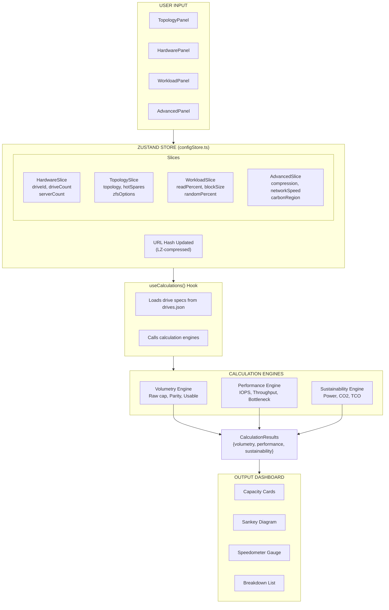
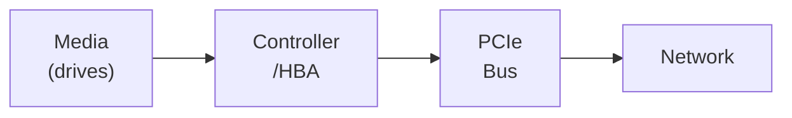
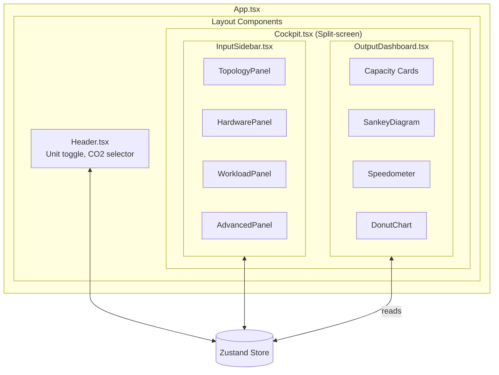

# Raidy Architecture Documentation

> **IMPORTANT**: This document must be kept up-to-date when making architectural changes to the codebase.

## Overview

Raidy is a browser-based Single Page Application (SPA) / Progressive Web App (PWA) for simulating modern storage infrastructure. It features a "Cockpit" split-screen UI with configuration on the left and real-time results on the right. All calculations run client-side with no backend dependency.

## Technology Stack

| Technology | Version | Purpose |
|------------|---------|---------|
| React | 19.x | UI framework (Functional Components + Hooks) |
| TypeScript | 5.x | Type safety (Strict Mode) |
| Zustand | 5.x | State management with URL persistence |
| Tailwind CSS | 4.x | Responsive styling (dark mode native) |
| Vite | 7.x | Build tool |
| D3-Sankey | - | Capacity waterfall visualization |
| Recharts | - | Charts and graphs |
| jsPDF | - | PDF report generation |
| LZ-String | - | URL state compression |

---

## Directory Structure

```
/src
├── components/              # React components
│   ├── layout/             # Main UI structure
│   │   ├── Cockpit.tsx     # Split-screen container
│   │   ├── Header.tsx      # Navigation bar
│   │   ├── InputSidebar.tsx # Left panel (config)
│   │   └── OutputDashboard.tsx # Right panel (results)
│   ├── inputs/             # Configuration panels
│   │   ├── TopologyPanel.tsx
│   │   ├── HardwarePanel.tsx
│   │   ├── WorkloadPanel.tsx
│   │   ├── AdvancedPanel.tsx
│   │   └── TieringPanel.tsx
│   ├── outputs/            # Result visualizations
│   │   ├── SankeyDiagram.tsx
│   │   ├── Speedometer.tsx
│   │   ├── DonutChart.tsx
│   │   └── AnimatedCounter.tsx
│   └── common/             # Shared UI components
├── engines/                # Calculation modules (pure functions)
│   ├── volumetry/          # Capacity calculations
│   ├── performance/        # IOPS/throughput analysis
│   ├── sustainability/     # Power/CO2/TCO
│   └── resilience/         # Monte Carlo (Web Worker)
├── hooks/                  # React hooks
│   ├── useCalculations.ts  # Main calculation orchestrator
│   └── useResilience.ts    # Monte Carlo simulation
├── store/                  # Zustand state management
│   ├── configStore.ts      # Main store
│   ├── urlStorage.ts       # URL hash persistence
│   └── slices/             # Store composition
├── types/                  # TypeScript definitions
├── workers/                # Web Workers
├── utils/                  # Utility functions
└── data/                   # Static data (drives.json)
```

---

## Data Flow



---

## Core Calculation Engines

### Module A: Volumetry Engine (`/src/engines/volumetry/`)

Calculates storage capacity and efficiency.

**Supported Topologies:**

- Standard RAID: 0, 1, 1E, 3, 4, 5, 5E, 5EE, 6, 10, 50, 60
- ZFS: Stripe, Mirror, RAID-Z1/Z2/Z3, dRAID1/2/3
- Microsoft S2D: Simple, Mirror, Parity, Dual Parity, MAP
- VMware vSAN: OSA and ESA (adaptive efficiency)
- Dell: PowerFlex, PowerStore, PowerScale, ObjectScale, PowerVault
- NetApp ONTAP: RAID-DP, RAID-TEC, ADP
- Ceph: Replicated and Erasure Coded pools
- Nutanix, Synology, and more

> Microsoft S2D enforces a minimum number of fault domains (nodes) per resiliency type (validated in `src/utils/validators.ts`): three-way mirror and single parity require ≥ 3, dual parity and mirror-accelerated parity (MAP) require ≥ 4. Fault domains are bounded to 2–16, the supported S2D cluster range.
>
> **Dual-parity efficiency** follows Microsoft's stepped Reed-Solomon/LRC tables (`getS2DDualParityEfficiency` in `strategies/s2d.ts`), which differ for all-flash vs hybrid clusters — all-flash: 50% (4–6) → 66.7% (7–8) → 75% (9–15) → 80% (16); hybrid: 50% (4–6) → 66.7% (7–11) → 72.7% (12–16). The orchestrator picks the table from the resiliency media (capacity tier when tiered, else the pool drive). MAP uses the same stepped efficiency for its parity portion.
>
> **Storage tiering** (S2D, vSAN OSA, Ceph WAL/DB, Nutanix hybrid) is resolved once by the shared `resolveTiering` (`src/engines/shared/tiering.ts`) and reused by all three engines. Tiering activates from the platform toggle plus drive selection; the capacity tier drives usable capacity and resiliency, while the cache tier is excluded from usable and counted only toward raw.

**Calculations:**

- Raw capacity = drive capacity × drive count
- Parity overhead (varies by topology)
- Hot spare capacity reservation (vSAN OSA/ESA use distributed slack space, so no dedicated spares are reserved)
- S2D rebuild reserve: the default `drive_failure` strategy reserves 1 capacity drive per server, capped at 4 drives cluster-wide (`capacity_raw × min(faultDomains, 4)`), per Microsoft's rule; an opt-in `node_failure` strategy reserves a whole node instead. The reserve is unallocated **raw** pool space, so it is removed from raw capacity **before** the resiliency efficiency multiplier (matching Microsoft / Azure Local) — reserving N raw drives costs N × efficiency of usable capacity
- S2D infrastructure reserve: a fixed ~277 GB cluster-wide reserve for Azure Local infrastructure volumes (Arc Resource Bridge + AKS images, ClusterPerformanceHistory, system), subtracted from post-efficiency usable capacity
- Filesystem overhead (per filesystem type)
- ZFS slop factor (1/32 of pool)
- Platform-specific losses
- Compression/dedup multipliers

### Module B: Performance Engine (`/src/engines/performance/`)

Calculates IOPS, throughput, and identifies bottlenecks.

**Bottleneck Chain:**



> vSAN ESA is NVMe-direct (drives attach straight to PCIe), so its chain omits the controller/HBA layer: Media → PCIe → Network.

**Calculations:**

- Per-drive IOPS and bandwidth. For tiered S2D the media layer is tier-aware (first-order write-back model): writes are absorbed by the cache tier, reads are a working-set-weighted blend of cache and capacity tiers
- RAID write penalty (2x for RAID1, 4x for RAID5, 6x for RAID6); S2D mirror write penalty scales with the copy count (two-way 2×, three-way 3×, MAP = `mirrorCopies + 0.5`), with `s2dOptions` threaded through `PerformanceInput`/`usePerformanceCalc`
- Controller limits (IOPS and throughput caps) — skipped for NVMe-direct topologies (vSAN ESA)
- PCIe bandwidth (lanes × generation speed)
- Network bandwidth limits — for vSAN, refined by full-duplex, on-the-wire compression, and the east-west traffic fraction (writes × replication/EC + remote reads)
- XFS stripe alignment (sunit/swidth)

### Module C: Resilience Engine (`/src/workers/resilienceWorker.ts`)

Monte Carlo simulation for data loss probability.

**Runs in Web Worker** (off main thread)

**Simulates (100,000 iterations):**

- Drive failures based on AFR
- Rebuild time calculations
- URE (Unrecoverable Read Error) probability
- Correlated batch failures
- Stress-induced failures during rebuild

### Module D: Sustainability Engine (`/src/engines/sustainability/`)

Power consumption, carbon footprint, and TCO.

**Calculations:**

- Drive power (idle + load weighted) — tier-aware for S2D: sums the cache and capacity tiers when tiering is active
- Server power
- Cooling overhead (based on PUE)
- Annual energy consumption (kWh)
- CO2 emissions (by region)
- Flash endurance (DWPD vs workload) — for hybrid S2D, computed on the SSD cache tier that absorbs the writes
- Total Cost of Ownership

---

## State Management

### Zustand Store Structure

The store is composed of slices for modularity:

```typescript
ConfigStore = HardwareSlice & TopologySlice & WorkloadSlice & AdvancedSlice
```

### URL Persistence

- State is serialized to JSON
- Compressed with LZ-String (~2KB typical)
- Stored in URL hash: `#raidy=<compressed-state>`
- Enables "Copy URL to Share" without backend

### Key State Values

| Slice | Key Fields |
|-------|------------|
| Hardware | driveId, driveCount, serverCount, serverPowerWatts |
| Topology | topology (type + level), hotSpares, zfsOptions, s2dOptions, etc. |
| Workload | readPercent, blockSize, randomPercent, dailyWriteVolume |
| Advanced | compressionRatio, networkSpeed, pue, carbonRegion, unitSystem |

---

## Type System

### Core Types

```typescript
// Topology (union of 15+ platform types)
Topology =
  | { type: 'standard', level: StandardRaidLevel }
  | { type: 'zfs', level: ZfsTopology }
  | { type: 's2d', level: S2DTopology }
  | { type: 'vsan', level: VsanTopology }
  // ... more platforms

// Drive specification
Drive {
  id: string
  model: string
  type: 'HDD' | 'SSD_SATA' | 'SSD_SAS' | 'SSD_NVMe'
  capacity_raw: number  // bytes
  performance: { iops_read, iops_write, bandwidth_read_mb, bandwidth_write_mb }
  reliability: { ure_rate, afr, dwpd }
  power: { idle_watts, load_watts }
  cost_avg: number  // USD
}

// Calculation results
CalculationResults {
  volumetry: VolumetryResult
  performance: PerformanceResult
  sustainability: SustainabilityResult
}
```

---

## Component Architecture



### Layout Components

| Component | Purpose |
|-----------|---------|
| `Cockpit.tsx` | Main split-screen container |
| `Header.tsx` | Navigation bar with unit toggle and CO2 selector |
| `InputSidebar.tsx` | Left panel with accordion sections |
| `OutputDashboard.tsx` | Right panel with results and visualizations |

### Input Components

All input components read from and write to the Zustand store:

| Component | Store Slice |
|-----------|-------------|
| `TopologyPanel.tsx` | TopologySlice |
| `HardwarePanel.tsx` | HardwareSlice |
| `WorkloadPanel.tsx` | WorkloadSlice |
| `AdvancedPanel.tsx` | AdvancedSlice |
| `TieringPanel.tsx` | TopologySlice (tiered storage) |

### Output Components

| Component | Data Source |
|-----------|-------------|
| `SankeyDiagram.tsx` | volumetry.breakdown |
| `Speedometer.tsx` | performance.layers |
| `DonutChart.tsx` | volumetry.efficiency |
| `AnimatedCounter.tsx` | Any numeric value |

---

## Hooks

### `useCalculations()`

Main hook that orchestrates all calculations:

- Watches store state changes
- Calls volumetry, performance, sustainability engines
- Returns memoized `CalculationResults`

### `useResilience()`

Manages Monte Carlo simulation:

- Spawns Web Worker
- Handles progress updates
- Returns result with survival probability

### `useFormatBytes()`

Formats byte values respecting unit system:

- Reads `unitSystem` from store
- Returns formatter function: `(bytes) => "1.5 TiB"` or `"1.5 TB"`

---

## Utilities

### Unit Conversion (`/src/utils/units.ts`)

```typescript
// Binary units (OS/filesystem display)
TiB = 1024^4  // Tebibyte
GiB = 1024^3  // Gibibyte

// Decimal units (drive marketing)
TB = 1000^4   // Terabyte
GB = 1000^3   // Gigabyte

formatBytes(bytes, 'binary')  // "1.5 TiB"
formatBytes(bytes, 'decimal') // "1.6 TB"
```

### Export Functions (`/src/utils/export*.ts`)

- `exportToPdf()` - Generate PDF report
- `downloadYaml()` - Export YAML config
- `downloadAnsible()` - Ansible playbook
- `downloadTerraform()` - Terraform config

---

## Adding New Features

### Adding a New Storage Platform

1. **Types** (`types/topology.ts`):
   - Add new topology type to union
   - Define platform-specific options interface

2. **Volumetry** (`engines/volumetry/index.ts`):
   - Add data fraction calculation
   - Handle platform-specific overhead

3. **Performance** (`engines/performance/index.ts`):
   - Add write penalty calculation
   - Define throughput limits

4. **UI** (`components/inputs/TopologyPanel.tsx`):
   - Add platform to selector
   - Create options sub-panel

### Adding a New Calculation Module

1. Create engine in `/src/engines/<module>/index.ts`
2. Define input/output types in `/src/types/results.ts`
3. Call from `useCalculations()` hook
4. Add output component in `/src/components/outputs/`
5. Render in `OutputDashboard.tsx`

---

## Build & Deployment

### Commands

```bash
npm run dev        # Development server
npm run build      # Production build
npm run typecheck  # TypeScript checking
npm run lint       # Biome linting
npm test           # Run tests
```

### Deployment

The app builds to static files suitable for:

- Vercel (recommended)
- Netlify
- GitHub Pages
- Any static file host

No backend required - all logic runs client-side.

---

## Key Files Reference

| File | Purpose |
|------|---------|
| `src/App.tsx` | Root component |
| `src/store/configStore.ts` | Zustand store |
| `src/hooks/useCalculations.ts` | Calculation orchestration |
| `src/engines/volumetry/index.ts` | Capacity calculations |
| `src/engines/performance/index.ts` | Performance calculations |
| `src/data/drives.json` | Drive database |
| `src/types/topology.ts` | Topology type definitions |
