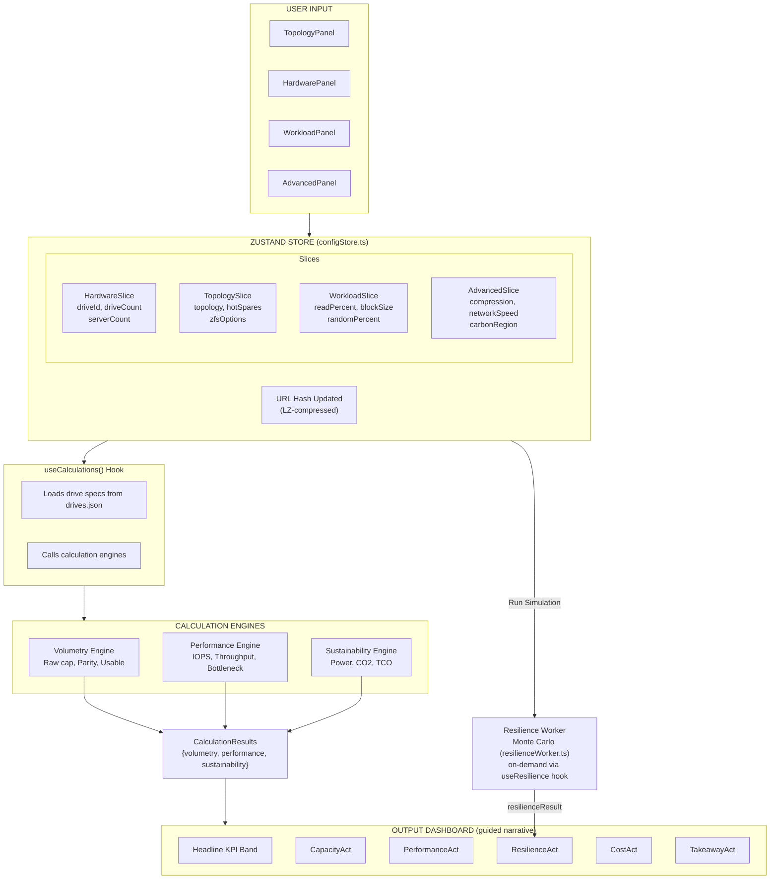
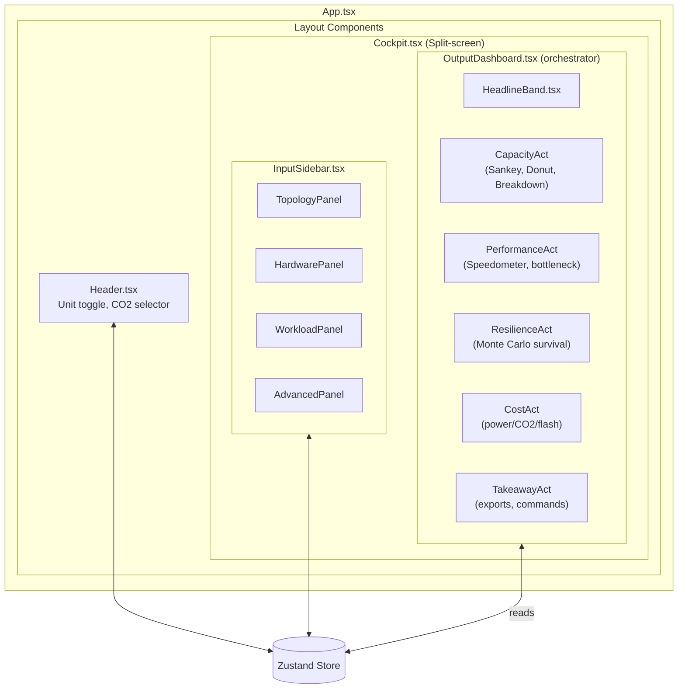

# Raidy Architecture Documentation

> **IMPORTANT**: This document must be kept up-to-date when making architectural changes to the codebase.

## Overview

Raidy is a browser-based Single Page Application (SPA) / Progressive Web App (PWA) for simulating modern storage infrastructure. It features a "Cockpit" split-screen UI with configuration on the left and a presales-first guided-narrative results dashboard on the right — a persistent headline KPI band followed by five narrative "acts" (Capacity, Performance, Resilience, Cost, Take-away). All calculations run client-side with no backend dependency.

## Technology Stack

| Technology | Version | Purpose |
|------------|---------|---------|
| React | 19.x | UI framework (Functional Components + Hooks) |
| TypeScript | 5.x | Type safety (Strict Mode) |
| Zustand | 5.x | State management with URL persistence |
| Tailwind CSS | 4.x | Responsive styling (dark mode native) |
| Vite | 8.x | Build tool |
| D3-Sankey | - | Capacity waterfall visualization |
| jspdf-autotable / pptxgenjs | - | PDF and PowerPoint export |
| jsPDF | - | PDF report generation |
| LZ-String | - | URL state compression |

---

## Directory Structure

```
/src
├── components/              # React components
│   ├── layout/             # Main UI structure
│   │   ├── Cockpit.tsx     # Split-screen container
│   │   ├── Header.tsx      # Navigation bar
│   │   ├── InputSidebar.tsx # Left panel (config)
│   │   └── OutputDashboard.tsx # Right panel — thin orchestrator (~200 lines)
│   ├── inputs/             # Configuration panels
│   │   ├── TopologyPanel.tsx
│   │   ├── HardwarePanel.tsx
│   │   ├── WorkloadPanel.tsx
│   │   ├── AdvancedPanel.tsx
│   │   └── TieringPanel.tsx
│   ├── outputs/            # Result visualizations
│   │   ├── HeadlineBand.tsx # Persistent headline KPI band
│   │   ├── acts/           # Narrative "acts" composed by OutputDashboard
│   │   │   ├── CapacityAct.tsx    # Sankey/donut + breakdown + ZFS/Longhorn/BeeGFS detail + Backup
│   │   │   ├── PerformanceAct.tsx # Gauges + bottleneck chain
│   │   │   ├── ResilienceAct.tsx  # Monte Carlo survival
│   │   │   ├── CostAct.tsx        # Power/energy/CO2/flash endurance
│   │   │   └── TakeawayAct.tsx    # Export buttons (CTA) + provisioning commands (<details>)
│   │   ├── MetricCard.tsx  # Shared presentational helper
│   │   ├── ProgressBar.tsx # Shared presentational helper
│   │   ├── SankeyDiagram.tsx
│   │   ├── Speedometer.tsx
│   │   ├── DonutChart.tsx
│   │   └── AnimatedCounter.tsx
│   ├── guide/              # In-app explanatory guide (GuideView + per-topic sections)
│   └── common/             # Shared UI components (FormControls, InfoTooltip, …)
├── engines/                # Calculation modules (pure functions)
│   ├── volumetry/          # Capacity calculations
│   ├── performance/        # IOPS/throughput analysis
│   ├── sustainability/     # Power/CO2/TCO
│   ├── backup/             # Backup sizing from change rate + retention
│   ├── shared/             # Cross-engine helpers (tiering resolution)
│   ├── capabilities.ts     # Per-platform input-relevance map
│   └── outputRelevance.ts  # Per-platform output-relevance predicates (shouldShowKpi/shouldShowSection)
├── hooks/                  # React hooks
│   ├── useCalculations.ts  # Main calculation orchestrator
│   └── useResilience.ts    # Monte Carlo simulation
├── store/                  # Zustand state management
│   ├── configStore.ts      # Main store
│   ├── urlStorage.ts       # URL hash persistence
│   └── slices/             # Store composition
├── types/                  # TypeScript definitions
├── workers/                # Web Workers
├── utils/                  # Utility functions
└── data/                   # Static data (drives.json)
```

---

## Data Flow


```mermaid
flowchart TB
    subgraph Input["USER INPUT"]
        TopologyPanel
        HardwarePanel
        WorkloadPanel
        AdvancedPanel
    end

    subgraph Store["ZUSTAND STORE (configStore.ts)"]
        subgraph Slices
            HW["HardwareSlice<br/>driveId, driveCount<br/>serverCount"]
            TP["TopologySlice<br/>topology, hotSpares<br/>zfsOptions"]
            WL["WorkloadSlice<br/>readPercent, blockSize<br/>randomPercent"]
            AD["AdvancedSlice<br/>compression, networkSpeed<br/>carbonRegion"]
        end
        URL["URL Hash Updated<br/>(LZ-compressed)"]
    end

    subgraph Calc["useCalculations() Hook"]
        Load["Loads drive specs from drives.json"]
        Call["Calls calculation engines"]
    end

    subgraph Engines["CALCULATION ENGINES"]
        Vol["Volumetry Engine<br/>Raw cap, Parity, Usable"]
        Perf["Performance Engine<br/>IOPS, Throughput, Bottleneck"]
        Sust["Sustainability Engine<br/>Power, CO2, TCO"]
    end

    Resil["Resilience Worker<br/>Monte Carlo (resilienceWorker.ts)<br/>on-demand via useResilience hook"]

    Results["CalculationResults<br/>{volumetry, performance, sustainability}"]

    subgraph Dashboard["OUTPUT DASHBOARD (guided narrative)"]
        Headline["Headline KPI Band"]
        Cap["CapacityAct"]
        PerfAct["PerformanceAct"]
        Res["ResilienceAct"]
        Cost["CostAct"]
        Take["TakeawayAct"]
    end

    Input --> Store
    Store --> Calc
    Calc --> Engines
    Vol --> Results
    Perf --> Results
    Sust --> Results
    Results --> Dashboard
    Store -->|"Run Simulation"| Resil
    Resil -->|"resilienceResult"| Res
```

## In-app guidance

Two layers, both often missed because neither shows up in the engines.

**`src/components/guide/`** — a full explanatory view (`GuideView` plus per-topic sections:
platform, resilience, sustainability) that answers "what does this figure mean", which the
dashboard deliberately does not stop to explain. Its copy lives in the `guide` i18n namespace,
the largest after `topology`.

**`InfoTooltip`** — a tooltip on every non-obvious control and output, sourced from the `help`
namespace and used by 17 components. It renders a `<button>` rather than plain text so it works on
touch, which is why `Toggle` wraps its label and its switch in two separate `<label>` elements: a
tooltip nested inside the switch's label would flip the setting when tapped to read it.

Both are why the locale files carry **10** namespaces, not the 8 the calculation path needs.

---
## Calculation engines

Four engines produce every published number. They are **pure functions** — no React, no DOM, no
store, no i18n (see [ADR-0004](./adr/0004-engines-are-pure-functions.md)) — and each dispatches to
one strategy per platform ([ADR-0003](./adr/0003-strategy-pattern-per-platform.md)).

| Engine | Location | Produces |
|---|---|---|
| Volumetry | `src/engines/volumetry/` | Usable and effective capacity, parity/filesystem/spare overheads, per-platform detail cards |
| Performance | `src/engines/performance/` | Burst and sustained IOPS and throughput, the Media→Controller→PCIe→Network bottleneck chain, latency |
| Resilience | `src/workers/resilienceWorker.ts` | Annual survival rate, URE and dual-failure probabilities, rebuild time — Monte Carlo in a Web Worker ([ADR-0006](./adr/0006-monte-carlo-and-the-superset-invariant.md)) |
| Sustainability | `src/engines/sustainability/` | Power draw, energy, CO₂, flash endurance, TCO |
| Backup | `src/engines/backup/` | Backup capacity from change rate and retention |

> **PowerScale is the exception to the strategy-per-platform shape.** `calculateVolumetry` returns
> early into `src/engines/volumetry/powerscale/` instead of selecting a `VolumetryStrategy`, because
> its input model is **node-pool-centric rather than drive-centric**: the user picks node models and
> pool sizes, and drive counts are derived from the vendor catalog rather than entered. A shared
> overhead added to the generic path will silently skip PowerScale. See
> [ADR-0014](./adr/0014-vendor-lookup-tables.md).

**The per-platform formulas, vendor tables, caveats and known limitations live in
[ENGINES.md](./ENGINES.md).** That is the document to read before changing a number; this one
describes how the pieces fit together.

## State Management

### Zustand Store Structure

The store is composed of slices for modularity:

```typescript
ConfigStore = HardwareSlice & TopologySlice & WorkloadSlice & AdvancedSlice
```

### URL Persistence

- State is serialized to JSON, including every platform-specific `*Options` object
  (`zfsOptions`, `s2dOptions`, `vsanOptions`, `cephOptions`, `longhornOptions`,
  `beeGfsOptions`, `powerFlexOptions`, `controllerOptions`, `netAppOptions`,
  `synologyOptions`, `nutanixOptions`, `objectscaleOptions`, `powerstoreOptions`,
  `powerscaleOptions`, `powervaultOptions`) — all validated by a matching Zod
  schema in `src/utils/schemas.ts` before being adopted
- Fields that equal their default value are omitted before compression
  (`omitDefaults` in `src/store/configStore.ts`) to keep links short — a link
  where only one platform's options were customized measures well under 1KB
  compressed; a pathological config with every platform simultaneously
  customized away from default (not reachable through the UI) measures ~2.8KB
- Compressed with LZ-String
- Stored in URL hash: `#raidy=<compressed-state>`
- Enables "Copy URL to Share" without backend
- Backward compatible: a field or whole `*Options` object missing from an older
  link (or a link generated by a Zustand persisted before a given platform's
  options existed) falls back to that slice's `DEFAULT_*_OPTIONS`, including
  gating booleans reading as `false` rather than `undefined`
- `getDefaultState()` (used by `resetToDefaults()` and as the baseline
  `omitDefaults()` diffs against) invokes each slice creator with inert
  `set`/`get` stubs rather than restating the slices' initial state, so the
  two cannot drift apart. This only works if every slice's `StateCreator`
  builds its initial state eagerly and touches `set`/`get` only inside the
  action closures it returns (the `sliceDefaults` constraint, documented on
  that helper in `src/store/configStore.ts`) — since `getDefaultState()` runs
  at module load and the stub throws, a slice that violates this fails on
  first import rather than producing a silently wrong default

> **Validation boundary.** Zustand's `persist` middleware wraps the partialized state in a
> `{ state, version }` envelope before `urlHashStorage` ever sees it. `urlHashStorage.getItem`
> (`src/store/urlStorage.ts`) requires that envelope shape and runs `validateUrlState` against
> `.state` — the actual config payload — not the envelope itself, then re-wraps the validated
> result with the original `version` so hydration still finds `{ state, version }`. A bare/flat
> payload is rejected outright rather than validated as-is: `createJSONStorage` has wrapped state
> in `{ state, version }` since the initial commit, so no released version can have ever written a
> flat link — one can only come from a hand-crafted URL, and is treated as corrupt. Unknown
> top-level keys are stripped by `ConfigStateSchema` (Zod's default; the schema is no longer
> `.passthrough()` at the root) rather than merged into the live store, since a key nobody reads
> would otherwise just keep getting re-persisted into the URL. The schema's closed unions
> (`BLOCK_SIZES`, `NETWORK_SPEEDS`, `CARBON_REGIONS`, `FS_TYPES`, etc.) derive from the same
> `as const` arrays in `src/types/` that the store and UI both use, so a new enum value can't
> validate on one side and reject on the other. The input panels (`WorkloadPanel`, `AdvancedPanel`,
> `Header`) import these same arrays to build their `<select>` options too, rather than
> hand-declaring a second copy — so a value added to a canonical array fails the panel's build (an
> exhaustiveness check on its label map, or an untranslated i18n key for `Header`'s
> `t()`-driven labels) instead of silently validating in the schema while never appearing in the
> UI. `CARBON_REGIONS` and `FS_TYPES` are ordered to match their `<select>`'s display order rather
> than alphabetically, since that order is the only place these arrays' order is ever observed —
> `z.enum(...)` and the `Record<Type, …>` lookups elsewhere in the codebase don't care about
> element order. See `docs/SECURITY.md` for why the validation-boundary distinction matters.

### Key State Values

| Slice | Key Fields |
|-------|------------|
| Hardware | driveId, driveCount, serverCount, serverPowerWatts |
| Topology | topology (type + level), hotSpares, zfsOptions, s2dOptions, etc. |
| Workload | readPercent, blockSize, randomPercent, dailyWriteVolume |
| Advanced | compressionRatio, networkSpeed, pue, carbonRegion, unitSystem |

---

## Type System

### Core Types

```typescript
// Topology (union of 15+ platform types)
Topology =
  | { type: 'standard', level: StandardRaidLevel }
  | { type: 'zfs', level: ZfsTopology }
  | { type: 's2d', level: S2DTopology }
  | { type: 'vsan', level: VsanTopology }
  // ... more platforms

// Drive specification
Drive {
  id: string
  model: string
  type: 'HDD' | 'SSD_SATA' | 'SSD_SAS' | 'SSD_NVMe'
  capacity_raw: number  // bytes
  performance: { iops_read, iops_write, bandwidth_read_mb, bandwidth_write_mb }
  reliability: { ure_rate, afr, dwpd }
  power: { idle_watts, load_watts }
  cost_avg: number  // USD
}

// Calculation results
CalculationResults {
  volumetry: VolumetryResult
  performance: PerformanceResult
  sustainability: SustainabilityResult
}
```

---

## Component Architecture


```mermaid
flowchart TB
    subgraph App["App.tsx"]
        subgraph Layout["Layout Components"]
            Header["Header.tsx<br/>Unit toggle, CO2 selector"]
            subgraph Cockpit["Cockpit.tsx (Split-screen)"]
                subgraph Left["InputSidebar.tsx"]
                    TopP["TopologyPanel"]
                    HardP["HardwarePanel"]
                    WorkP["WorkloadPanel"]
                    AdvP["AdvancedPanel"]
                end
                subgraph Right["OutputDashboard.tsx (orchestrator)"]
                    HB["HeadlineBand.tsx"]
                    CapAct["CapacityAct<br/>(Sankey, Donut, Breakdown)"]
                    PerfAct["PerformanceAct<br/>(Speedometer, bottleneck)"]
                    ResAct["ResilienceAct<br/>(Monte Carlo survival)"]
                    CostAct["CostAct<br/>(power/CO2/flash)"]
                    TakeAct["TakeawayAct<br/>(exports, commands)"]
                end
            end
        end
    end

    Store[(Zustand Store)]
    Left <--> Store
    Right <-- reads --> Store
    Header <--> Store
```

### Layout Components

| Component | Purpose |
|-----------|---------|
| `Cockpit.tsx` | Main split-screen container |
| `Header.tsx` | Navigation bar with unit toggle and CO2 selector |
| `InputSidebar.tsx` | Left panel with accordion sections |
| `OutputDashboard.tsx` | Right panel — thin orchestrator composing the headline band and five acts |

### Input Components

All input components read from and write to the Zustand store:

| Component | Store Slice |
|-----------|-------------|
| `TopologyPanel.tsx` | TopologySlice |
| `HardwarePanel.tsx` | HardwareSlice |
| `WorkloadPanel.tsx` | WorkloadSlice |
| `AdvancedPanel.tsx` | AdvancedSlice |
| `TieringPanel.tsx` | TopologySlice (tiered storage) |

### Output Components

`OutputDashboard.tsx` composes one persistent band plus five narrative "acts", in this order:
headline band → `CapacityAct` → `PerformanceAct`/`ResilienceAct` (side by side on wide screens,
`xl:grid-cols-2`) → `CostAct` → `TakeawayAct`. Which headline tiles and sections actually render
is decided by `src/engines/outputRelevance.ts` (`shouldShowKpi`/`shouldShowSection`), a pure
predicate module driven by the same probe-verified capability flags as `capabilities.ts` (e.g.
the Effective-capacity tile is hidden for RAID and shown for ZFS+compression) plus result
presence (e.g. the Survival tile only appears once a Monte Carlo run has produced a result).
Not-applicable is omitted; applicable-but-zero is still shown.

The same module also exports `backupApplies(topology)`, the one predicate that decides both
whether `AdvancedPanel` shows the backup inputs and whether `CapacityAct` renders the backup card
— an input and the output it feeds are one decision, so they cannot drift into a live figure
computed from a control the user cannot see.

| Component | Purpose / Data Source |
|-----------|------------------------|
| `HeadlineBand.tsx` | Persistent KPI band (usable/effective capacity, efficiency, peak IOPS, survival, annual energy) |
| `acts/CapacityAct.tsx` | Sankey + donut + breakdown list + ZFS/Longhorn/BeeGFS detail panels + Backup sub-panel |
| `CapacityRow.tsx` | Shared label/description/dual-unit row used by the ZFS, Longhorn and BeeGFS detail panels |
| `acts/PerformanceAct.tsx` | Speedometer gauges + bottleneck chain |
| `acts/ResilienceAct.tsx` | Monte Carlo survival probability, run/progress controls |
| `acts/CostAct.tsx` | Power, annual energy, CO2, flash endurance |
| `acts/TakeawayAct.tsx` | Export buttons (PDF/PPTX) as closing CTA, plus provisioning commands in a collapsible `<details>` |
| `SankeyDiagram.tsx` | volumetry.breakdown (used inside `CapacityAct`) |
| `Speedometer.tsx` | performance.layers (used inside `PerformanceAct`) |
| `DonutChart.tsx` | volumetry.efficiency (used inside `CapacityAct`) |
| `MetricCard.tsx` / `ProgressBar.tsx` | Shared presentational helpers used across acts |
| `AnimatedCounter.tsx` | Any numeric value |

---

## Hooks

### `useCalculations()`

Main hook that orchestrates all calculations:

- Watches store state changes
- Calls volumetry, performance, sustainability engines
- Returns memoized `CalculationResults`

### `useResilience()`

Manages Monte Carlo simulation:

- Spawns Web Worker
- Handles progress updates
- Returns result with survival probability

The simulated population must describe the same cluster the capacity card does. For most
platforms that is `driveCount × effectiveServerCount` in `effectiveServerCount` fault groups,
minus hot spares (#80): `usesDistributedSpares(topology.type) ? 0 : hotSpares * effectiveServerCount`,
clamped at zero — the identical rule volumetry (`useVolumetryCalc.ts:80`) and performance
(`usePerformanceCalc.ts:77`) apply, so a spare is never counted as a data-bearing drive in any of
the three engines. The four tiered platforms (S2D, vSAN OSA, Ceph, Nutanix) apply the same
subtraction to the capacity tier inside `tieredPlatformScope` — though as of the 2026-08-05
relevance sweep all four are in `DISTRIBUTED_SPARE_TOPOLOGIES`, so the subtraction resolves to
zero for every one of them, and BeeGFS is the platform that now exercises that tiered path with
a non-zero spare count. Ten platforms rebuild from distributed reserve capacity and zero the
subtraction via `usesDistributedSpares`; the five that keep dedicated spares are standard RAID,
ZFS, PowerVault, Synology/NetApp (`proprietary`) and BeeGFS. That list is the single source of
truth for hot-spare relevance (#130): there is deliberately no `PLATFORM_CAPABILITIES` flag for
it, because the engines really do subtract for all fifteen types and the zeroing happens in the
hooks before the engine is called — a capability flag would be refuted by the probe, which drives
`calculateVolumetry` directly. The capability map answers "does the engine read this input";
`DISTRIBUTED_SPARE_TOPOLOGIES` answers the different question "does this platform have a spare
drive to configure".
BeeGFS applies hot spares inside its own resolver,
`resolveBeeGfsSimulationScope`, so it is excluded from this generic subtraction to avoid
double-counting. The worker itself does not credit a spare with shortening the rebuild window —
that residual gap is tracked in `docs/BACKLOG.md`.

Platforms that need something else register a resolver in `SIMULATION_SCOPE_BY_TOPOLOGY`
(`src/hooks/useResilience.ts`), a `Partial<Record<TopologyType, SimulationScopeResolver>>` lookup
mirroring `NETWORK_MODEL_BY_TOPOLOGY` above; a topology with no entry gets the default population
described in the previous sentence. Both `tieredPlatformScope` and the BeeGFS resolver read a
single `tieringOptions?: TieringResolverOptions` argument threaded through `UseResilienceOptions`
and `SimulationScopeContext` — the same complete bag `useTieringOptions()` assembles for the other
three engines (see the Storage Tiering note above) — rather than four separately hand-listed
`*Options` props, closing the class of bug where a caller forwarded a subset of the platform
option bags into the hook and silently dropped one (#59, #60, #92). BeeGFS's resolver reads
`tieringOptions?.beeGfsOptions` (the bag already carries it, so it is not a separate prop) and
calls the exported pure helper `resolveBeeGfsSimulationScope`, which reuses
`resolveBeeGfsUsableDrives` + `calculateStorageTargets` — the same functions volumetry and the
options panel use — so hot spares, MDT tiering and stranded drives are applied identically on
both sides, and the fault group is a whole storage target at its real width.
Under MDT tiering the drive characteristics handed to the worker (capacity, URE rate, AFR) also
follow the capacity tier rather than the Hardware panel's drive. MDT drives themselves are not
simulated — a separate protection domain, the same scope choice made for Ceph's WAL/DB tier.

`SIMULATION_SCOPE_BY_TOPOLOGY` holds five entries. BeeGFS resolves its own storage-target
population; S2D, vSAN OSA, Ceph and Nutanix share `tieredPlatformScope`, which reads the capacity
tier through `resolveTiering` so resilience simulates the same drives volumetry counts. Platforms
absent from the table use the naive `driveCount × serverCount` population.

**The fast tier as a shared failure domain (#88)** is modelled for the two platforms with a vendor
statement behind the cascade: vSAN OSA, where Broadcom documents that a cache device failure is
treated as a failure of the entire disk group, and Ceph, where Red Hat documents that a corrupt
`block.db` impacts every OSD included in it. `SHARED_FAST_TIER_TOPOLOGIES` in `useResilience.ts`
lists them, and the absentees are the point: S2D and Nutanix resolve through the same
`tieredPlatformScope`, but their fast tiers are write-back cache and no vendor documents the loss
taking the capacity tier down.

The worker rolls each fast-tier device once per simulated day; a hit forces
`ceil(driveCount / fastTierDeviceCount)` drives to fail at once, through the *same* failure body as
ordinary failures so the mirror/group assignment, URE check, rebuild trigger and correlated window
all apply. Both inputs default to zero, so every other configuration is bit-for-bit unchanged —
pinned by `tests/workers/sharedFastTierFailureDomain.spec.ts`, which asserts a zero-AFR fast tier
reproduces the pre-#88 result exactly.

Counter-intuitive result worth keeping: at the same per-device AFR, *more and smaller* fault
domains are worse than fewer and larger ones (16 devices × 3 drives gives 0.78 survival, 2 × 24
gives 0.82, at identical expected drives lost). Device count does not map monotonically to harm.

**Known conservatism: the cascade is node-blind.** Forced failures take the same weighted-random
assignment as ordinary ones, so they can land on two replicas of the same mirror pair. Real
placement forbids it — vSAN's default fault domain is the host, Ceph's default CRUSH failure domain
is the host — so one device failing takes at most one copy of any object. `assignNodesRoundRobin`
computes exactly the node identity needed (#113 added it for this purpose) and `mirrorGroupNodes`
is threaded into the model, but nothing reads it yet. The error runs in the safe direction, so the
superset invariant holds; the practical consequence is that dual-failure figures for mirrored
levels are an **upper bound**, not a calibrated estimate.

Deliberately still not modelled: rebuild behaviour after a whole group is lost, and vSAN's
deduplication amplification, where *any* device failure fails the disk group.

The resilience model carries a deliberate invariant: **its simulated failure set must be a
superset of the physically real one**, so the tool may understate resilience but never overstate
it. Hot spares and stranded drives are excluded because their failure is genuinely not a
data-loss event; when not even one whole target forms, every remaining *usable* drive is put
into a single over-wide group, which is more failure-prone than any real target and therefore
stays on the conservative side of the invariant.

One degenerate input remains: if hot spares consume the entire population there are no
usable drives left, the simulation runs over zero drives and reports 100% survival. That is
not a modelling claim — a cluster with no data-bearing drive holds no data to lose, and
volumetry independently zero-states the same configuration, so the dashboard stays internally
consistent (0 usable capacity alongside 0% risk). Clamping to a synthetic drive would report a
non-zero risk for data that does not exist, so the behaviour is documented rather than clamped.

### `useFormatBytes()`

Formats byte values respecting unit system:

- Reads `unitSystem` from store
- Returns formatter function: `(bytes) => "1.5 TiB"` or `"1.5 TB"`

---

## Utilities

### Unit Conversion (`/src/utils/units.ts`)

```typescript
// Binary units (OS/filesystem display)
TiB = 1024^4  // Tebibyte
GiB = 1024^3  // Gibibyte

// Decimal units (drive marketing)
TB = 1000^4   // Terabyte
GB = 1000^3   // Gigabyte

formatBytes(bytes, 'binary')  // "1.5 TiB"
formatBytes(bytes, 'decimal') // "1.6 TB"
```

### Export Functions (`/src/utils/export*.ts`)

- `exportToPdf()` - Generate PDF report
- `exportToPptx()` (`exportPptx.ts`) - Generate the PowerPoint one-pager (Sankey + 2×2 gauges +
  stat lines), theme-aware (light/dark) and locale-aware

The YAML/Ansible/Terraform export (`exportConfig.ts`) was removed in the 2026-08-05 sweep — it
only ever knew ZFS, and a Terraform fragment derived from a capacity estimate has no hosts,
network or credentials, so it was not deployable. Raidy is a sizing tool; the deliverables are
the PDF and PPTX. The ZFS provisioning commands users actually copied still exist, in
`TakeawayAct.tsx`'s collapsible `<details>`.

`src/utils/pptxContent.ts` is a pure content builder — `buildPptxContent()` takes calculation
results, locale, and unit system and returns a plain-data slide description with no side effects
or `pptxgenjs` calls. `exportPptx.ts` consumes that data to render slides and capture chart PNGs;
keeping the two separate means the slide content itself is unit-testable without a DOM or the
PPTX library.

---

## Adding New Features

### Adding a New Storage Platform

1. **Types** (`types/topology.ts`):
   - Add new topology type to union
   - Define platform-specific options interface, with a `DEFAULT_*_OPTIONS` constant

2. **Volumetry** (`engines/volumetry/index.ts`):
   - Add data fraction calculation
   - Handle platform-specific overhead

3. **Performance** (`engines/performance/index.ts`):
   - Add write penalty calculation
   - Define throughput limits

4. **UI** (`components/inputs/TopologyPanel.tsx`):
   - Add platform to selector
   - Create options sub-panel

5. **Resilience** (`src/workers/resilienceWorker.ts`):
   - Add a case to `getParityDrives`

6. **URL persistence** (`src/utils/schemas.ts`, `src/store/configStore.ts`):
   - Add a Zod schema for the new `*Options` object and wire it into `ConfigStateSchema`
   - Add the field to `PERSISTED_KEYS` in `src/store/persistedKeys.ts` (or `EPHEMERAL_KEYS`,
     with a reason, if it's deliberately excluded from shared links) — `partialize` derives
     from this list, and `getDefaultState()` needs no edit since it already reads every slice's
     initial state. The parity test in `tests/store/persistedKeys.spec.ts` fails until you do
     this, by design — see the URL Persistence section above

The compiler catches a missed platform at most of the above sites — an unhandled union member
in a `switch` is a TypeScript error under strict mode. Two categories fail **silently** instead,
and both were the source of real bugs during BeeGFS's implementation, so treat them as a
checklist, not an afterthought:

- **Falls through to a wrong default instead of erroring.** `VALID_TOPOLOGY_TYPES`
  (`src/engines/volumetry/helpers/calculationHelpers.ts`) is a plain array, not a type-checked
  union — a missing entry doesn't fail to compile, it fails validation at runtime for a topology
  that otherwise works. `overhead/filesystem-overhead.ts`'s outer `case` statement (keyed on
  `topology.type`) and `performance/utils.ts`'s latency `case` statement both have a fallback
  branch, so an omitted platform silently inherits another platform's overhead/latency number
  instead of erroring. (`getFsTypeOverhead`, the inner switch keyed on the closed `FsType` union,
  is exhaustive and calls `assertNever` in its `default` — a missing filesystem case fails to
  compile there.)
  `OutputDashboard.tsx`'s `mirrorCopies` derivation (an IIFE of platform checks) behaves the
  same way — a platform that needs a non-default `mirrorCopies` but isn't listed just gets `1`.
- **Zod schema drift decides what a URL link actually carries.** `utils/schemas.ts` needs the
  new platform's options object added as its own schema *and* wired into the discriminated
  `ConfigStateSchema` — omitting it doesn't fail to compile (every field on `ConfigStateSchema`
  is optional), it silently drops that platform's options from every shared link,
  or worse, lets an unvalidated object through if the wiring is partial. This exact class of bug
  is what `fix(store): persist every platform's *Options through Copy URL to Share` and
  `fix(security): validate the real payload inside the persist envelope, not around it` fixed for
  all 15 platforms — see the URL Persistence section above.

Before declaring a new platform done, verify all six numbered sites above **and** grep for the
new topology type across `VALID_TOPOLOGY_TYPES`, `getParityDrives`, `filesystem-overhead.ts`,
`performance/utils.ts`, `utils/schemas.ts`, and `OutputDashboard.tsx`'s `mirrorCopies` block —
none of the six will fail a build if missed.

### Adding a New Calculation Module

1. Create engine in `/src/engines/<module>/index.ts`
2. Define input/output types in `/src/types/results.ts`
3. Call from `useCalculations()` hook
4. Add output component in `/src/components/outputs/` (or a new act under `outputs/acts/` if it
   warrants its own narrative section)
5. Render inside the relevant act (or compose a new act in `OutputDashboard.tsx`); gate
   visibility with `shouldShowKpi`/`shouldShowSection` in `src/engines/outputRelevance.ts` if the
   output isn't universally applicable

---

## Build & Deployment

### Commands

```bash
npm run dev        # Development server
npm run build      # Production build
npm run typecheck  # TypeScript checking
npm run lint       # Biome linting
npm test           # Run tests
```

### Deployment

The app builds to static files suitable for:

- Vercel (recommended)
- Netlify
- GitHub Pages
- Any static file host

No backend required - all logic runs client-side.

---

## Key Files Reference

| File | Purpose |
|------|---------|
| `src/App.tsx` | Root component |
| `src/store/configStore.ts` | Zustand store |
| `src/hooks/useCalculations.ts` | Calculation orchestration |
| `src/engines/volumetry/index.ts` | Capacity calculations |
| `src/engines/performance/index.ts` | Performance calculations |
| `src/data/drives.json` | Drive database |
| `src/types/topology.ts` | Topology type definitions |
