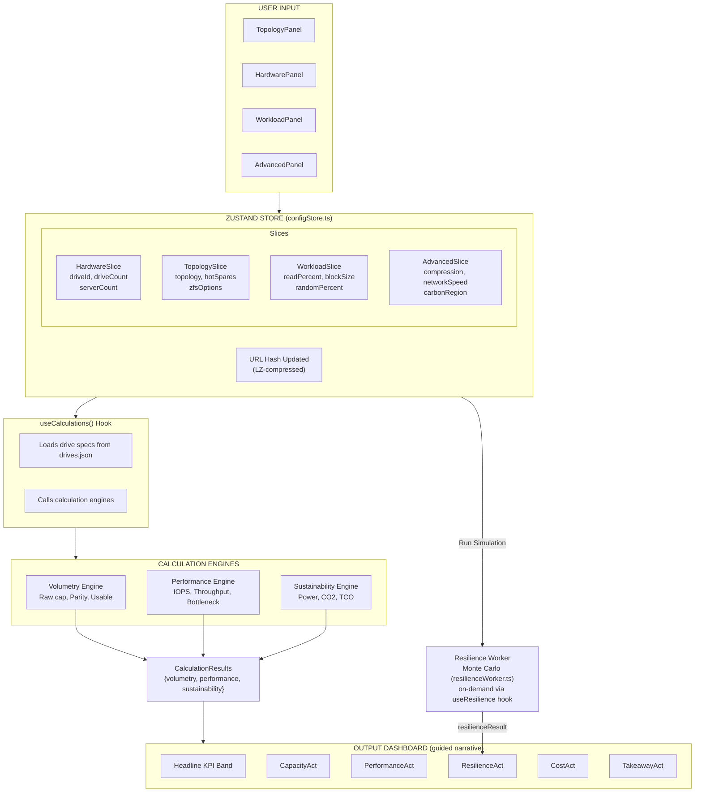
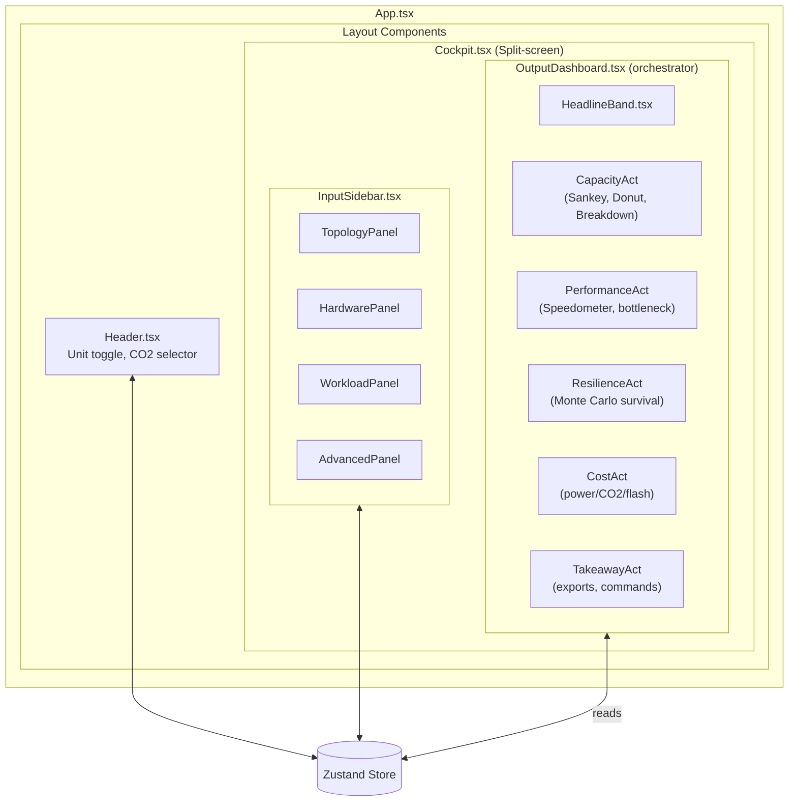

# Raidy Architecture Documentation

> **IMPORTANT**: This document must be kept up-to-date when making architectural changes to the codebase.

## Overview

Raidy is a browser-based Single Page Application (SPA) / Progressive Web App (PWA) for simulating modern storage infrastructure. It features a "Cockpit" split-screen UI with configuration on the left and a presales-first guided-narrative results dashboard on the right — a persistent headline KPI band followed by five narrative "acts" (Capacity, Performance, Resilience, Cost, Take-away). All calculations run client-side with no backend dependency.

## Technology Stack

| Technology | Version | Purpose |
|------------|---------|---------|
| React | 19.x | UI framework (Functional Components + Hooks) |
| TypeScript | 5.x | Type safety (Strict Mode) |
| Zustand | 5.x | State management with URL persistence |
| Tailwind CSS | 4.x | Responsive styling (dark mode native) |
| Vite | 7.x | Build tool |
| D3-Sankey | - | Capacity waterfall visualization |
| Recharts | - | Charts and graphs |
| jsPDF | - | PDF report generation |
| LZ-String | - | URL state compression |

---

## Directory Structure

```
/src
├── components/              # React components
│   ├── layout/             # Main UI structure
│   │   ├── Cockpit.tsx     # Split-screen container
│   │   ├── Header.tsx      # Navigation bar
│   │   ├── InputSidebar.tsx # Left panel (config)
│   │   └── OutputDashboard.tsx # Right panel — thin orchestrator (~249 lines)
│   ├── inputs/             # Configuration panels
│   │   ├── TopologyPanel.tsx
│   │   ├── HardwarePanel.tsx
│   │   ├── WorkloadPanel.tsx
│   │   ├── AdvancedPanel.tsx
│   │   └── TieringPanel.tsx
│   ├── outputs/            # Result visualizations
│   │   ├── HeadlineBand.tsx # Persistent headline KPI band
│   │   ├── acts/           # Narrative "acts" composed by OutputDashboard
│   │   │   ├── CapacityAct.tsx    # Sankey/donut + breakdown + ZFS/Longhorn/BeeGFS detail + Backup
│   │   │   ├── PerformanceAct.tsx # Gauges + bottleneck chain
│   │   │   ├── ResilienceAct.tsx  # Monte Carlo survival
│   │   │   ├── CostAct.tsx        # Power/energy/CO2/flash endurance
│   │   │   └── TakeawayAct.tsx    # Export buttons (CTA) + provisioning commands (<details>)
│   │   ├── MetricCard.tsx  # Shared presentational helper
│   │   ├── ProgressBar.tsx # Shared presentational helper
│   │   ├── SankeyDiagram.tsx
│   │   ├── Speedometer.tsx
│   │   ├── DonutChart.tsx
│   │   └── AnimatedCounter.tsx
│   └── common/             # Shared UI components
├── engines/                # Calculation modules (pure functions)
│   ├── volumetry/          # Capacity calculations
│   ├── performance/        # IOPS/throughput analysis
│   ├── sustainability/     # Power/CO2/TCO
│   ├── resilience/         # Monte Carlo (Web Worker)
│   ├── capabilities.ts     # Per-platform input-relevance map
│   └── outputRelevance.ts  # Per-platform output-relevance predicates (shouldShowKpi/shouldShowSection)
├── hooks/                  # React hooks
│   ├── useCalculations.ts  # Main calculation orchestrator
│   └── useResilience.ts    # Monte Carlo simulation
├── store/                  # Zustand state management
│   ├── configStore.ts      # Main store
│   ├── urlStorage.ts       # URL hash persistence
│   └── slices/             # Store composition
├── types/                  # TypeScript definitions
├── workers/                # Web Workers
├── utils/                  # Utility functions
└── data/                   # Static data (drives.json)
```

---

## Data Flow


```mermaid
flowchart TB
    subgraph Input["USER INPUT"]
        TopologyPanel
        HardwarePanel
        WorkloadPanel
        AdvancedPanel
    end

    subgraph Store["ZUSTAND STORE (configStore.ts)"]
        subgraph Slices
            HW["HardwareSlice<br/>driveId, driveCount<br/>serverCount"]
            TP["TopologySlice<br/>topology, hotSpares<br/>zfsOptions"]
            WL["WorkloadSlice<br/>readPercent, blockSize<br/>randomPercent"]
            AD["AdvancedSlice<br/>compression, networkSpeed<br/>carbonRegion"]
        end
        URL["URL Hash Updated<br/>(LZ-compressed)"]
    end

    subgraph Calc["useCalculations() Hook"]
        Load["Loads drive specs from drives.json"]
        Call["Calls calculation engines"]
    end

    subgraph Engines["CALCULATION ENGINES"]
        Vol["Volumetry Engine<br/>Raw cap, Parity, Usable"]
        Perf["Performance Engine<br/>IOPS, Throughput, Bottleneck"]
        Sust["Sustainability Engine<br/>Power, CO2, TCO"]
    end

    Resil["Resilience Worker<br/>Monte Carlo (resilienceWorker.ts)<br/>on-demand via useResilience hook"]

    Results["CalculationResults<br/>{volumetry, performance, sustainability}"]

    subgraph Dashboard["OUTPUT DASHBOARD (guided narrative)"]
        Headline["Headline KPI Band"]
        Cap["CapacityAct"]
        PerfAct["PerformanceAct"]
        Res["ResilienceAct"]
        Cost["CostAct"]
        Take["TakeawayAct"]
    end

    Input --> Store
    Store --> Calc
    Calc --> Engines
    Vol --> Results
    Perf --> Results
    Sust --> Results
    Results --> Dashboard
    Store -->|"Run Simulation"| Resil
    Resil -->|"resilienceResult"| Res
```

---

## Core Calculation Engines

### Module A: Volumetry Engine (`/src/engines/volumetry/`)

Calculates storage capacity and efficiency.

**Supported Topologies:**

- Standard RAID: 0, 1, 1E, 3, 4, 5, 5E, 5EE, 6, 10, 50, 60
- ZFS: Stripe, Mirror, RAID-Z1/Z2/Z3, dRAID1/2/3
- Microsoft S2D: Simple, Mirror, Parity, Dual Parity, MAP
- VMware vSAN: OSA and ESA (adaptive efficiency)
- Dell: PowerFlex, PowerStore, PowerScale, ObjectScale, PowerVault
- NetApp ONTAP: RAID-DP, RAID-TEC, ADP
- Ceph: Replicated and Erasure Coded pools
- Longhorn: SUSE/Kubernetes distributed block storage, replicated pools (R2/R3)
- BeeGFS: parallel filesystem, storage-target-local RAID6/RAID10/RAIDz2/single with optional
  Buddy Mirroring, and metadata-target sizing advisory
- Nutanix, Synology, and more

> Microsoft S2D enforces a minimum number of fault domains (nodes) per resiliency type (validated in `src/utils/validators.ts`): three-way mirror and single parity require ≥ 3, dual parity and mirror-accelerated parity (MAP) require ≥ 4. Fault domains are bounded to 2–16, the supported S2D cluster range.
>
> **Dual-parity efficiency** follows Microsoft's stepped Reed-Solomon/LRC tables (`getS2DDualParityEfficiency` in `strategies/s2d.ts`), which differ for all-flash vs hybrid clusters — all-flash: 50% (4–6) → 66.7% (7–8) → 75% (9–15) → 80% (16); hybrid: 50% (4–6) → 66.7% (7–11) → 72.7% (12–16). The orchestrator picks the table from the resiliency media (capacity tier when tiered, else the pool drive). MAP uses the same stepped efficiency for its parity portion.
>
> **Storage tiering** (S2D, vSAN OSA, Ceph WAL/DB, Nutanix hybrid) is resolved once by the shared `resolveTiering` (`src/engines/shared/tiering.ts`) and reused by all four engines, including resilience. Tiering activates from the platform toggle plus drive selection; the capacity tier drives usable capacity and resiliency, while the cache tier is excluded from usable and counted only toward raw. `resolveTiering` takes a single `TieringResolverOptions` bag (`s2dOptions`, `vsanOptions`, `cephOptions`, `nutanixOptions`, `beeGfsOptions`) rather than four-or-five separate parameters, and `useTieringOptions()` (`src/hooks/useTieringOptions.ts`) assembles that bag once from the store. `useVolumetryCalc`, `usePerformanceCalc`, `useSustainabilityCalc` and `useResilience` all consume the same hook's output as a single `tieringOptions` prop/argument rather than hand-listing the platform fields individually — hand-listing a subset was the exact mistake that dropped a platform's options and caused issues #59, #60 and #92. Adding a new tiered platform means adding it once to `TieringResolverOptions` and `useTieringOptions()`; every consumer picks it up automatically since none of them destructure the bag into named fields.
>
> **Longhorn** (`strategies/longhorn.ts`) is modeled on Ceph replicated pools: usable capacity is redundancy-limited to `1/R` (R = 2 or 3 replicas), reduced by host filesystem overhead, then narrowed by a free-space guardrail (`F = 1 − "Storage Minimal Available %"`) and a snapshot reserve (divided by the snapshot headroom). It has no native compression/dedup. Growth headroom and over-provisioning are advisory readouts only — they inform the recommended committed-data ceiling but are never subtracted from usable capacity.
>
> **BeeGFS** (`strategies/beegfs.ts`) does not fit the level-maps-to-an-efficiency-fraction shape every other platform uses. BeeGFS federates *storage targets*, and each target is itself a local RAID volume, so the modelling is deliberately unlike the rest of the engine:
>
> - **Topology level = the storage target's local RAID**, not cluster-wide protection: `beegfs_raid6`, `beegfs_raid10`, `beegfs_raidz2` (ZFS RAIDz2 target), or `beegfs_single` (bare drive, no local RAID). Local efficiency is `(drivesPerTarget − 2) / drivesPerTarget` for RAID6/RAIDz2, `0.5` for RAID10, `1` for single — `drivesPerTarget` (default 12) is an explicit input because RAID6 efficiency is meaningless without target width. Because the level describes real local hardware, it also decides the **controller class** — BeeGFS is *not* pure software-defined storage (see the controller note in the Performance Engine section below).
> - **Cluster-level protection is Buddy Mirroring**, expressed as two independent booleans in `BeeGfsOptions` rather than folded into the level enum: `storageBuddyMirror` (data, halves usable capacity when on) and `metadataBuddyMirror` (metadata, doubles the MDT capacity requirement). BeeGFS genuinely lets you mirror one without the other, which a combined level enum could not express.
> - **Capacity is computed on whole storage targets only.** A storage target *is* a local RAID volume, so drives that do not complete one ("stranded" drives) join no target and hold no data. `calculateStorageTargets` / `resolveBeeGfsUsableDrives` (`strategies/beegfs.ts`) are the single source of truth for that derivation and are shared by three surfaces that must never disagree: `calculateVolumetry`, `BeeGfsOptionsPanel` (via `deriveBeeGfsStorageTargets`), and `useResilience` (via `resolveBeeGfsSimulationScope`). Stranded drives still count toward **raw** capacity and get their own "BeeGFS Stranded Drives" breakdown bucket; the `validators.ts` stranded-drive warning reads its count from `beeGfsDetails` rather than recomputing it. **The performance engine deliberately does not apply this rounding** — a stranded drive still exists on the bus and still draws from the controller/PCIe budget, so pricing it is correct for a bottleneck model even though excluding it is correct for a capacity model. The two engines can therefore report different tiered-BeeGFS drive counts by design; see the cross-referencing comments at `beeGfsTargets` in `volumetry/index.ts` and `capUsableDrives` in `performance/index.ts` (#91).
> - **Metadata targets (MDT) reuse the shared `TieringConfig` primitive** (`src/types/topology.ts`, resolved by `src/engines/shared/tiering.ts`) instead of introducing a BeeGFS-specific concept: `fastTier` = MDT, `capacityTier` = storage targets. `resolveTiering`'s existing semantics are already exactly right for this — the fast tier counts toward **raw** capacity but never toward **usable**, the same treatment Ceph WAL/DB offload gets. A metadata-sizing advisory (`beeGfsDetails`, built in `volumetry/index.ts` following the `longhornDetails` pattern) compares MDT usable capacity against the BeeGFS-documented 0.3–0.5% rule of thumb and surfaces an estimated file count; a `validators.ts` alert fires when the MDT is undersized or absent.

**Calculations:**

- Raw capacity = drive capacity × drive count
- Parity overhead (varies by topology)
- Hot spare capacity reservation (vSAN OSA/ESA use distributed slack space, so no dedicated spares are reserved)
- S2D rebuild reserve: the default `drive_failure` strategy reserves 1 capacity drive per server, capped at 4 drives cluster-wide (`capacity_raw × min(faultDomains, 4)`), per Microsoft's rule; an opt-in `node_failure` strategy reserves a whole node instead. The reserve is unallocated **raw** pool space, so it is removed from raw capacity **before** the resiliency efficiency multiplier (matching Microsoft / Azure Local) — reserving N raw drives costs N × efficiency of usable capacity
- S2D infrastructure reserve: a fixed ~277 GB cluster-wide reserve for Azure Local infrastructure volumes (Arc Resource Bridge + AKS images, ClusterPerformanceHistory, system), subtracted from post-efficiency usable capacity
- Filesystem overhead (per filesystem type)
- ZFS slop factor (1/32 of pool)
- Platform-specific losses
- Compression/dedup multipliers

> **Platform capability map** (`src/engines/capabilities.ts`) is the single source of truth for
> which inputs actually move the volumetry output for a given topology type. It exposes
> `getCapabilities(type)` and `shouldShowControl(control, type)` for the four
> global/cross-cutting controls whose usefulness varies by platform: `compression`, `dedup`,
> `hotSpares`, `serverCount`. The map is probe-enforced — `tests/engines/capabilities.spec.ts`
> drives `calculateVolumetry` with each flag toggled and asserts the flag matches actual engine
> behavior (e.g. the global `compressionRatio`/`dedupRatio` inputs only move
> `effectiveCapacity` for ZFS; every other platform either has no data-reduction step or reduces
> through its own platform-specific options panel instead), so the map cannot silently drift
> from the engines it describes. The UI consumes it directly: `AdvancedPanel.tsx` hides the
> global compression/dedup sliders unless `shouldShowControl('compression'|'dedup', topology.type)`
> is true, and `HardwarePanel.tsx` hides the servers/nodes slider unless
> `shouldShowControl('serverCount', topology.type)` is true (with an additional carve-out for
> standard RAID50/60, where the same input doubles as the RAID-group count). Controls are
> hidden, not disabled, when a platform's engine ignores them — the store values are left
> untouched so a stored URL config round-trips unchanged. For `serverCount` specifically, hiding
> the control is not enough on its own: switching topology never resets the stored value, so a
> stale multi-node `serverCount` would otherwise keep silently scaling results after switching to
> a single-node platform. `effectiveServerCount(serverCount, topology)` (also in
> `src/engines/capabilities.ts`) closes that gap by clamping to `1` at the calculation-hook
> boundary (`useVolumetryCalc`, `usePerformanceCalc`, `useSustainabilityCalc`,
> `useCalculations`, `useResilience`) whenever the control is hidden — the store's `serverCount`
> itself is left untouched, so it round-trips unchanged if the user switches back.

> **Fraction-vs-percent unit audit** (issue #61, `docs/BACKLOG.md` B3, closed with no code
> change). A real bug of this shape was fixed in `[1.15.0]`:
> `netAppOptions.snapshotReserve` is a *fraction* that `overheadCalculator.ts` multiplies
> directly against capacity, but its Zod bound allowed `0..100` and the panel wrote a raw
> percent into it — a slider at 5 meant a 500% reserve. Every field in `src/types/topology.ts`
> named `*Percent`/`*Reserve`/`*Ratio`/`*Fraction`, plus every numeric option that reaches a
> multiplication against a capacity, was re-audited on the same three axes (engine use / Zod
> bound / UI write) and all agree:
>
> | Field | Engine use | Zod bound | UI write |
> |---|---|---|---|
> | `netAppOptions.snapshotReserve` | multiplies directly (fraction) | `0..1` | panel divides by 100 on write, multiplies by 100 on display |
> | `powerstoreOptions.snapshotReservePercent` | divided by 100 (percent) | `0..100` | panel writes raw percent |
> | `powerstoreOptions.systemOverheadPercent` | divided by 100 (percent) | `0..100` | panel writes raw percent |
> | `powerscaleOptions.snapshotReservePercent` | divided by 100 (percent) | `0..100` | panel writes raw percent |
> | `objectscaleOptions.systemOverheadPercent` | divided by 100 (percent) | `0..100` | panel writes raw percent |
> | `netAppOptions.waflOverhead` | multiplies directly (fraction) | `0..1` | panel divides by 100 on write, multiplies by 100 on display |
> | `netAppOptions.dataReductionRatio` | multiplies directly (true ratio, not a proportion) | `1..20` | panel writes raw ratio |
> | `nutanixOptions.systemOverhead` | multiplies directly (fraction) | `0..1` | panel divides by 100 on write, multiplies by 100 on display |
> | `powerFlexOptions.fgOverhead` | multiplies directly (fraction) | `0..1` | panel divides by 100 on write, multiplies by 100 on display |
> | `cephOptions.safeCapacityThreshold` | multiplies directly (fraction, default 0.85) | `0..1` | panel divides by 100 on write, multiplies by 100 on display |
> | `longhornOptions.minimalAvailablePercent` | divided by 100 (percent) | `0..100` | panel writes raw percent |
> | `longhornOptions.overProvisioningPercent` | not multiplied against capacity (advisory display only) | `0..1000` | panel writes raw percent |
> | `beeGfsOptions.fsOverheadPercent` | divided by 100 (percent) | `0.5..5` | panel writes raw percent |
> | `TieringConfig.workingSetPercent` | divided by 100 (percent) | `0..100` | panel writes raw percent |
> | `*.compressionRatio` / `*.dedupRatio` (vSAN, PowerFlex, Nutanix, PowerStore, PowerScale, ObjectScale, global) | multiply directly (true ratios, e.g. 1.5 = 1.5:1, not proportions of 1) | `1..10` | panels write the raw ratio value; no /100 or ×100 anywhere in this family |
>
> Every live (engine-consumed) field's three facts agree, so no code changed. This table
> originally also listed four fields with no engine consumer at all — `synologyOptions.btrfsOverhead`,
> `objectscaleOptions.fillRatePercent`, `objectscaleOptions.networkEfficiencyFactor`, and
> `cephOptions.walDbRatio` — a different bug class from the fraction/percent mismatch this audit
> was checking for. They were removed from the schema entirely in issue #104 rather than wired up:
> `btrfsOverhead` and `fillRatePercent` were unreachable in both directions (no panel ever wrote
> them, no engine ever read them); `networkEfficiencyFactor` had a control but no defensible,
> citable sizing rule connecting "East-West traffic factor" to a network-bandwidth derate (unlike
> vSAN's/BeeGFS's `NETWORK_MODEL_BY_TOPOLOGY` entries, which cite real replication mechanics);
> `walDbRatio` had no defensible connection point either — Ceph's WAL/DB tier device count and
> size are already set explicitly by the user via the tiering picker (`resolveTiering` /
> `TieringConfig`), so deriving them from a ratio would mean silently overriding that explicit
> choice rather than modeling anything real.

### Module B: Performance Engine (`/src/engines/performance/`)

Calculates IOPS, throughput, and identifies bottlenecks.

**Bottleneck Chain:**


```mermaid
flowchart LR
    Media["Media<br/>(drives)"] --> Controller["Controller<br/>/HBA"] --> PCIe["PCIe<br/>Bus"] --> Network
```

> vSAN ESA is NVMe-direct (drives attach straight to PCIe), so its chain omits the controller/HBA layer: Media → PCIe → Network.

> **Which controllers a topology may use** is resolved by `getControllerRequirement(type, level?)`
> in `src/types/topology.ts`, which returns `'hba'`, `'raid'` or `'either'`; `requiresHba` and
> `getControllerOptions` are thin wrappers over it, and the store's `setTopology` snaps the
> selected controller whenever the current one becomes invalid. Software-defined platforms
> (ZFS, S2D, vSAN, Ceph, PowerFlex, Nutanix, Longhorn) resolve to `'hba'` from
> `HBA_REQUIRED_TOPOLOGIES`; appliances (PowerVault, PowerStore, PowerScale, ObjectScale) get
> their fixed built-in controllers; everything else resolves to `'raid'`.
>
> **BeeGFS is the one platform whose answer depends on the *level*, not the type.** BeeGFS never
> sees the disks — each storage target is a local volume it addresses as a single block device —
> so the controller class follows the local RAID: `beegfs_raid6` and `beegfs_raid10` are
> hardware-RAID targets (`'raid'`), `beegfs_raidz2` needs an IT-mode HBA because ZFS addresses
> disks directly (`'hba'`), and `beegfs_single` (one drive per target) works behind either
> (`'either'`, so the UI offers the union). Classifying BeeGFS as pure SDS modelled a RAID6 node
> at the HBA ceiling — ~2.7× the IOPS and ~1.6× the throughput of a real PERC H755. BeeGFS
> declares no entry in `DEFAULT_CONTROLLER_BY_TOPOLOGY`: that map is keyed by type so it cannot
> express a per-level preference, and BeeGFS mandates no specific model (both mdraid and
> PERC/LSI targets are common), so the generic "keep the user's choice unless it became invalid"
> fallback applies.
>
> **`CONTROLLER_LIMITS` basis (#84).** Every entry describes ONE controller at 100% 4K random
> read for `iops` and 100% 64K sequential read for `throughputMBs`, measured with FIO on an
> optimal (non-degraded) volume. This is the basis and it does not change when a new controller
> is added — mixing a rebuild-time, degraded-mode, or multi-controller-aggregate figure into
> either field re-introduces the exact defect #84 fixed (PERC IOPS were 3.4–4.7x below any
> measured per-controller number, from an undocumented basis, while throughput was already close
> to the real figure — so the controller layer of the bottleneck chain was not comparable across
> controllers). The four PERC entries are sourced from two vendor-commissioned, independently
> verified lab reports at this exact basis: Tolly Report #223103 (Jan 2023, PERC 10/11/12 vs each
> other, FIO on RHEL 8.6) and Signal65 PERC13 lab testing (2026), corroborated by StorageReview. Every non-PERC entry
> (generic HBAs, LSI/Broadcom cards, Dell HBA355i/e, PowerVault ME5, PowerStore, PowerScale,
> ObjectScale, and the generic `software`/`hardware`/`gpu` placeholders) is marked `ESTIMATED` in
> its own comment in `CONTROLLER_LIMITS` — no published per-controller figure at this basis could
> be found for any of them at the time of the #84 audit. **Adding a new controller:** find the
> vendor's or an independent lab's per-controller FIO figure at this exact basis and cite it in
> the entry's comment; if none exists, carry the estimate forward and say so — never derive a
> number from another controller's ratio and present it as a specification. See
> `docs/superpowers/specs/2026-08-04-controller-limits-basis.md` for the full sourcing detail.
>
> **Controller cache policy is not modelled.** `RaidControllerOptions.writePolicy`, `readPolicy`
> and `cacheSize` reach the config export but no engine. A battery/flash-backed write-back cache
> is a finite buffer: under a sustained write stream the host rate converges on the rate at which
> the cache drains to the array, so the sustained ceiling is the back-end array's and the RAID
> 5/6 read-modify-write penalty is deferred, never removed. The real benefits — write latency and
> burst absorption — are properties of the *unsaturated* cache, a transient this engine does not
> model. See the doc-comment on `writePolicy` for the full derivation.

**Calculations:**

- Per-drive IOPS and bandwidth. For tiered S2D the media layer is tier-aware (first-order write-back model): writes are absorbed by the cache tier, reads are a working-set-weighted blend of cache and capacity tiers

  For a tiered configuration the Media layer is sized from the **capacity tier** — its drive specs
  and its drive count, hot spares subtracted — matching volumetry. On top of that baseline, some
  platforms also model a fast-tier contribution, looked up from
  `FAST_TIER_MODEL_BY_TOPOLOGY` (`src/engines/performance/utils/fast-tier-models.ts`), a
  `Partial<Record<TopologyType, FastTierModelResolver>>` table following the same pattern as
  `NETWORK_MODEL_BY_TOPOLOGY` below — adding a platform's fast-tier model is a table entry, not a
  new branch in the orchestrator:

  - **S2D** (its own branch in `performance/index.ts`, not the table): writes fully absorbed by
    the cache tier; reads a working-set blend of cache and capacity tiers.
  - **vSAN OSA** reuses the S2D blend, gated on `vsanOptions.diskGroupMode`: writes are fully
    absorbed by the cache tier in **both** hybrid and all-flash disk groups (VMware documents
    100% write-buffer allocation in both modes). Reads blend by `workingSetPercent`, but **only in
    hybrid mode** — an all-flash disk group dedicates 100% of its cache device to the write buffer
    and 0% to read cache, so an all-flash configuration's reads stay on the capacity-tier-only
    path unchanged.
  - **Nutanix hybrid clusters** get a write-only model, split by `randomPercent` (not the S2D
    blend — the OpLog's real split key is I/O size, not working set): the random-write share is
    absorbed by the OpLog (cache tier); the sequential-write share routes straight to the extent
    pool (capacity tier), mirroring Nutanix's documented >1.5MB-outstanding sequential-bypass
    rule. Reads are **not modelled** — ILM tier promotion is touch-count-triggered with no
    vendor-published hit-rate to anchor a `workingSetPercent`-style split.
  - **Ceph (WAL/DB offload)** and **BeeGFS (metadata targets)** have no table entry and model no
    fast-tier contribution at all, deliberately and permanently: Ceph's WAL/DB device is never in
    the data read path and its write-path effect is removing spindle contention with bulk data,
    not adding a parallel pool of write IOPS — there is no vendor-published number to turn
    "removes contention" into an IOPS delta. A BeeGFS metadata target stores only inodes,
    directory entries, and striping maps, never file content, so it is structurally incapable of
    serving bulk data I/O — folding it into the media-layer IOPS number would be a category
    error, not an approximation.

  Every model here is driven by an existing workload/topology input (`workingSetPercent`,
  `randomPercent`, `vsanOptions.diskGroupMode`) — none invents a number the app does not collect.
  See `docs/superpowers/specs/2026-08-04-fast-tier-performance-research.md` for the per-platform
  research and sourcing behind these choices (issue #89).

  > **Two-tier blends are bounded, not weighted sums** (issue #111). When a fixed fraction of
  > traffic must be served by each of two tiers concurrently (S2D/vSAN's read blend by
  > `workingSetPercent`, Nutanix's write blend by `randomPercent`), the achievable total is capped
  > by whichever tier saturates first — `T = min(capA / shareA, capB / (1 - shareA))` — not a
  > weighted average of the two tiers' capacities. A weighted sum lets the fast tier's raw
  > capacity leak into the total in proportion to how *little* traffic it serves, so the answer
  > gets more absurd the faster the cache is (e.g. `ws=0.5`, cache 1,000,000 IOPS, capacity 1,000
  > IOPS: weighted-sum formula gives 500,500; the correct bound gives ~2,000). All three blends
  > share one helper, `boundedTierThroughput` in `fast-tier-models.ts`, so they cannot drift back
  > into the wrong shape. The write-back absorption itself (`writeCapIOPS = cacheCount ×
  > cacheWriteIOPS` for S2D/vSAN, unconditional on any split) is a different, still-open question —
  > it models unbounded write-back with no destage/drain-rate ceiling, tracked separately from
  > this fix.
- RAID write penalty (2x for RAID1, 4x for RAID5, 6x for RAID6); S2D mirror write penalty scales with the copy count (two-way 2×, three-way 3×, MAP = `mirrorCopies + 0.5`), with `s2dOptions` threaded through `PerformanceInput`/`usePerformanceCalc`
- Controller limits (IOPS and throughput caps) — skipped for NVMe-direct topologies (vSAN ESA)
- PCIe bandwidth (lanes × generation speed)
- Network bandwidth limits — for vSAN, refined by full-duplex, on-the-wire compression, and the east-west traffic fraction (writes × replication/EC + remote reads); for BeeGFS, by write amplification from Buddy Mirroring
- XFS stripe alignment (sunit/swidth) — for a tiered configuration this also uses the
  spare-adjusted capacity-tier drive count, the same population the Media layer above uses, so the
  suggested stripe width always matches the pool that actually holds data

> **Per-platform network model** (`NETWORK_MODEL_BY_TOPOLOGY` in
> `src/engines/performance/utils/bottleneck-chain.ts`) is a
> `Partial<Record<TopologyType, NetworkModelResolver>>` lookup table that supplies the
> full-duplex multiplier, on-the-wire compression ratio, and fabric traffic fraction used by
> `calculateNetworkLimits`. Topologies with no entry fall back to the neutral default (1×
> everything, i.e. the plain aggregate-bandwidth model). This replaced a vSAN-only branch that
> was hardcoded directly in `performance/index.ts` against `bottleneck-chain.ts`; the vSAN
> resolver (`vsanNetworkModel`) was extracted unchanged into the table, and the BeeGFS resolver
> (`beeGfsNetworkModel`) was added alongside it — Buddy Mirroring doubles write traffic on the
> wire (`trafficFraction = write% × (storageBuddyMirror ? 2 : 1) + read% × 1`). Adding a
> platform's network behaviour going forward is a table entry, not another branch in the
> orchestrator.

### Module C: Resilience Engine (`/src/workers/resilienceWorker.ts`)

Monte Carlo simulation for data loss probability.

**Runs in Web Worker** (off main thread)

**Simulates (100,000 iterations):**

- Drive failures based on AFR
- Rebuild time calculations
- URE (Unrecoverable Read Error) probability
- Correlated batch failures
- Stress-induced failures during rebuild

**Node placement (#113):** every pair slot records the node holding each of its two copies
(`pairNodeA` / `pairNodeB` in `buildGroupPairState`), defaulting to one group per node. Nothing
reads these arrays for a failure decision yet, so they are behaviour-neutral by construction —
they exist because correlated-failure models cannot be built without them. Injecting group-kill
logic into a worker with no node identity produces spurious survival collapses 41-62% of the
time: both copies of a pair can sit in the group that dies, an arrangement real placement rules
(vSAN fault domains, Ceph CRUSH by host, Nutanix distinct-node replicas) never create. See
`docs/superpowers/specs/2026-08-04-fast-tier-failure-domain-design.md`.

**Group topology (RAID 50/60, every BeeGFS group level):** drives are partitioned into
`numGroups` independent fault groups via `distributeAcrossGroups()`, which spreads the
`driveCount % numGroups` remainder one-per-group across the first groups rather than dropping it
— every drive is modelled, at the cost of groups being heterogeneous in width. A group's
rebuild-read volume (and therefore its URE exposure) is computed per group from its own width,
except mirrored group layouts (`beegfs_raid10`): a RAID10 target rebuilds by reading only the
surviving mirror partner (one drive), never the whole target. Unmerged `beegfs_raid10` groups
also get dedicated per-pair state via `buildGroupPairState()` instead of the flat failure counter
every other group layout uses — a width-W target is `floor(W / 2)` independent mirror pairs (plus
one unpaired, unprotected drive if W is odd), and the target is lost only when one specific pair
loses both members, not at a fixed group-wide failure count. Buddy-merged `beegfs_raid10` groups
(two targets combined into one doubled-tolerance unit) are unaffected and keep the flat counter.
The per-simulation topology/group/pair setup (`computeTopologyModel`) is computed once per Monte
Carlo run rather than once per iteration, since none of it depends on the random failure draws.
See `tests/fixtures/resilience-vectors.ts` for measured before/after survival figures.

### Module D: Sustainability Engine (`/src/engines/sustainability/`)

Power consumption, carbon footprint, and TCO.

**Calculations:**

- Drive power (idle + load weighted) — tier-aware for S2D: sums the cache and capacity tiers when tiering is active
- Server power
- Cooling overhead (based on PUE)
- Annual energy consumption (kWh)
- CO2 emissions (by region)
- Flash endurance (DWPD vs workload) — for hybrid S2D, computed on the SSD cache tier that absorbs the writes
- Total Cost of Ownership

---

## State Management

### Zustand Store Structure

The store is composed of slices for modularity:

```typescript
ConfigStore = HardwareSlice & TopologySlice & WorkloadSlice & AdvancedSlice
```

### URL Persistence

- State is serialized to JSON, including every platform-specific `*Options` object
  (`zfsOptions`, `s2dOptions`, `vsanOptions`, `cephOptions`, `longhornOptions`,
  `beeGfsOptions`, `powerFlexOptions`, `controllerOptions`, `netAppOptions`,
  `synologyOptions`, `nutanixOptions`, `objectscaleOptions`, `powerstoreOptions`,
  `powerscaleOptions`, `powervaultOptions`) — all validated by a matching Zod
  schema in `src/utils/schemas.ts` before being adopted
- Fields that equal their default value are omitted before compression
  (`omitDefaults` in `src/store/configStore.ts`) to keep links short — a link
  where only one platform's options were customized measures well under 1KB
  compressed; a pathological config with every platform simultaneously
  customized away from default (not reachable through the UI) measures ~2.8KB
- Compressed with LZ-String
- Stored in URL hash: `#raidy=<compressed-state>`
- Enables "Copy URL to Share" without backend
- Backward compatible: a field or whole `*Options` object missing from an older
  link (or a link generated by a Zustand persisted before a given platform's
  options existed) falls back to that slice's `DEFAULT_*_OPTIONS`, including
  gating booleans reading as `false` rather than `undefined`
- `getDefaultState()` (used by `resetToDefaults()` and as the baseline
  `omitDefaults()` diffs against) invokes each slice creator with inert
  `set`/`get` stubs rather than restating the slices' initial state, so the
  two cannot drift apart. This only works if every slice's `StateCreator`
  builds its initial state eagerly and touches `set`/`get` only inside the
  action closures it returns (the `sliceDefaults` constraint, documented on
  that helper in `src/store/configStore.ts`) — since `getDefaultState()` runs
  at module load and the stub throws, a slice that violates this fails on
  first import rather than producing a silently wrong default

> **Validation boundary.** Zustand's `persist` middleware wraps the partialized state in a
> `{ state, version }` envelope before `urlHashStorage` ever sees it. `urlHashStorage.getItem`
> (`src/store/urlStorage.ts`) requires that envelope shape and runs `validateUrlState` against
> `.state` — the actual config payload — not the envelope itself, then re-wraps the validated
> result with the original `version` so hydration still finds `{ state, version }`. A bare/flat
> payload is rejected outright rather than validated as-is: `createJSONStorage` has wrapped state
> in `{ state, version }` since the initial commit, so no released version can have ever written a
> flat link — one can only come from a hand-crafted URL, and is treated as corrupt. Unknown
> top-level keys are stripped by `ConfigStateSchema` (Zod's default; the schema is no longer
> `.passthrough()` at the root) rather than merged into the live store, since a key nobody reads
> would otherwise just keep getting re-persisted into the URL. The schema's closed unions
> (`BLOCK_SIZES`, `NETWORK_SPEEDS`, `CARBON_REGIONS`, `FS_TYPES`, etc.) derive from the same
> `as const` arrays in `src/types/` that the store and UI both use, so a new enum value can't
> validate on one side and reject on the other. The input panels (`WorkloadPanel`, `AdvancedPanel`,
> `Header`) import these same arrays to build their `<select>` options too, rather than
> hand-declaring a second copy — so a value added to a canonical array fails the panel's build (an
> exhaustiveness check on its label map, or an untranslated i18n key for `Header`'s
> `t()`-driven labels) instead of silently validating in the schema while never appearing in the
> UI. `CARBON_REGIONS` and `FS_TYPES` are ordered to match their `<select>`'s display order rather
> than alphabetically, since that order is the only place these arrays' order is ever observed —
> `z.enum(...)` and the `Record<Type, …>` lookups elsewhere in the codebase don't care about
> element order. See `docs/SECURITY.md` for why the validation-boundary distinction matters.

### Key State Values

| Slice | Key Fields |
|-------|------------|
| Hardware | driveId, driveCount, serverCount, serverPowerWatts |
| Topology | topology (type + level), hotSpares, zfsOptions, s2dOptions, etc. |
| Workload | readPercent, blockSize, randomPercent, dailyWriteVolume |
| Advanced | compressionRatio, networkSpeed, pue, carbonRegion, unitSystem |

---

## Type System

### Core Types

```typescript
// Topology (union of 15+ platform types)
Topology =
  | { type: 'standard', level: StandardRaidLevel }
  | { type: 'zfs', level: ZfsTopology }
  | { type: 's2d', level: S2DTopology }
  | { type: 'vsan', level: VsanTopology }
  // ... more platforms

// Drive specification
Drive {
  id: string
  model: string
  type: 'HDD' | 'SSD_SATA' | 'SSD_SAS' | 'SSD_NVMe'
  capacity_raw: number  // bytes
  performance: { iops_read, iops_write, bandwidth_read_mb, bandwidth_write_mb }
  reliability: { ure_rate, afr, dwpd }
  power: { idle_watts, load_watts }
  cost_avg: number  // USD
}

// Calculation results
CalculationResults {
  volumetry: VolumetryResult
  performance: PerformanceResult
  sustainability: SustainabilityResult
}
```

---

## Component Architecture


```mermaid
flowchart TB
    subgraph App["App.tsx"]
        subgraph Layout["Layout Components"]
            Header["Header.tsx<br/>Unit toggle, CO2 selector"]
            subgraph Cockpit["Cockpit.tsx (Split-screen)"]
                subgraph Left["InputSidebar.tsx"]
                    TopP["TopologyPanel"]
                    HardP["HardwarePanel"]
                    WorkP["WorkloadPanel"]
                    AdvP["AdvancedPanel"]
                end
                subgraph Right["OutputDashboard.tsx (orchestrator)"]
                    HB["HeadlineBand.tsx"]
                    CapAct["CapacityAct<br/>(Sankey, Donut, Breakdown)"]
                    PerfAct["PerformanceAct<br/>(Speedometer, bottleneck)"]
                    ResAct["ResilienceAct<br/>(Monte Carlo survival)"]
                    CostAct["CostAct<br/>(power/CO2/flash)"]
                    TakeAct["TakeawayAct<br/>(exports, commands)"]
                end
            end
        end
    end

    Store[(Zustand Store)]
    Left <--> Store
    Right <-- reads --> Store
    Header <--> Store
```

### Layout Components

| Component | Purpose |
|-----------|---------|
| `Cockpit.tsx` | Main split-screen container |
| `Header.tsx` | Navigation bar with unit toggle and CO2 selector |
| `InputSidebar.tsx` | Left panel with accordion sections |
| `OutputDashboard.tsx` | Right panel — thin orchestrator composing the headline band and five acts |

### Input Components

All input components read from and write to the Zustand store:

| Component | Store Slice |
|-----------|-------------|
| `TopologyPanel.tsx` | TopologySlice |
| `HardwarePanel.tsx` | HardwareSlice |
| `WorkloadPanel.tsx` | WorkloadSlice |
| `AdvancedPanel.tsx` | AdvancedSlice |
| `TieringPanel.tsx` | TopologySlice (tiered storage) |

### Output Components

`OutputDashboard.tsx` composes one persistent band plus five narrative "acts", in this order:
headline band → `CapacityAct` → `PerformanceAct`/`ResilienceAct` (side by side on wide screens,
`xl:grid-cols-2`) → `CostAct` → `TakeawayAct`. Which headline tiles and sections actually render
is decided by `src/engines/outputRelevance.ts` (`shouldShowKpi`/`shouldShowSection`), a pure
predicate module driven by the same probe-verified capability flags as `capabilities.ts` (e.g.
the Effective-capacity tile is hidden for RAID and shown for ZFS+compression) plus result
presence (e.g. the Survival tile only appears once a Monte Carlo run has produced a result).
Not-applicable is omitted; applicable-but-zero is still shown.

| Component | Purpose / Data Source |
|-----------|------------------------|
| `HeadlineBand.tsx` | Persistent KPI band (usable/effective capacity, efficiency, peak IOPS, survival, annual energy) |
| `acts/CapacityAct.tsx` | Sankey + donut + breakdown list + ZFS/Longhorn/BeeGFS detail panels + Backup sub-panel |
| `CapacityRow.tsx` | Shared label/description/dual-unit row used by the ZFS, Longhorn and BeeGFS detail panels |
| `acts/PerformanceAct.tsx` | Speedometer gauges + bottleneck chain |
| `acts/ResilienceAct.tsx` | Monte Carlo survival probability, run/progress controls |
| `acts/CostAct.tsx` | Power, annual energy, CO2, flash endurance |
| `acts/TakeawayAct.tsx` | Export buttons (PDF/PPTX/YAML/Ansible/Terraform) as closing CTA, plus provisioning commands in a collapsible `<details>` |
| `SankeyDiagram.tsx` | volumetry.breakdown (used inside `CapacityAct`) |
| `Speedometer.tsx` | performance.layers (used inside `PerformanceAct`) |
| `DonutChart.tsx` | volumetry.efficiency (used inside `CapacityAct`) |
| `MetricCard.tsx` / `ProgressBar.tsx` | Shared presentational helpers used across acts |
| `AnimatedCounter.tsx` | Any numeric value |

---

## Hooks

### `useCalculations()`

Main hook that orchestrates all calculations:

- Watches store state changes
- Calls volumetry, performance, sustainability engines
- Returns memoized `CalculationResults`

### `useResilience()`

Manages Monte Carlo simulation:

- Spawns Web Worker
- Handles progress updates
- Returns result with survival probability

The simulated population must describe the same cluster the capacity card does. For most
platforms that is `driveCount × effectiveServerCount` in `effectiveServerCount` fault groups,
minus hot spares (#80): `usesDistributedSpares(topology.type) ? 0 : hotSpares * effectiveServerCount`,
clamped at zero — the identical rule volumetry (`useVolumetryCalc.ts:80`) and performance
(`usePerformanceCalc.ts:77`) apply, so a spare is never counted as a data-bearing drive in any of
the three engines. The four tiered platforms (S2D, vSAN OSA, Ceph, Nutanix) apply the same
subtraction to the capacity tier inside `tieredPlatformScope`; vSAN's distributed spares zero it
out via `usesDistributedSpares`. BeeGFS applies hot spares inside its own resolver,
`resolveBeeGfsSimulationScope`, so it is excluded from this generic subtraction to avoid
double-counting. The worker itself does not credit a spare with shortening the rebuild window —
that residual gap is tracked in `docs/BACKLOG.md`.

Platforms that need something else register a resolver in `SIMULATION_SCOPE_BY_TOPOLOGY`
(`src/hooks/useResilience.ts`), a `Partial<Record<TopologyType, SimulationScopeResolver>>` lookup
mirroring `NETWORK_MODEL_BY_TOPOLOGY` above; a topology with no entry gets the default population
described in the previous sentence. Both `tieredPlatformScope` and the BeeGFS resolver read a
single `tieringOptions?: TieringResolverOptions` argument threaded through `UseResilienceOptions`
and `SimulationScopeContext` — the same complete bag `useTieringOptions()` assembles for the other
three engines (see the Storage Tiering note above) — rather than four separately hand-listed
`*Options` props, closing the class of bug where a caller forwarded a subset of the platform
option bags into the hook and silently dropped one (#59, #60, #92). BeeGFS's resolver reads
`tieringOptions?.beeGfsOptions` (the bag already carries it, so it is not a separate prop) and
calls the exported pure helper `resolveBeeGfsSimulationScope`, which reuses
`resolveBeeGfsUsableDrives` + `calculateStorageTargets` — the same functions volumetry and the
options panel use — so hot spares, MDT tiering and stranded drives are applied identically on
both sides, and the fault group is a whole storage target at its real width.
Under MDT tiering the drive characteristics handed to the worker (capacity, URE rate, AFR) also
follow the capacity tier rather than the Hardware panel's drive. MDT drives themselves are not
simulated — a separate protection domain, the same scope choice made for Ceph's WAL/DB tier.

`SIMULATION_SCOPE_BY_TOPOLOGY` holds five entries. BeeGFS resolves its own storage-target
population; S2D, vSAN OSA, Ceph and Nutanix share `tieredPlatformScope`, which reads the capacity
tier through `resolveTiering` so resilience simulates the same drives volumetry counts. Platforms
absent from the table use the naive `driveCount × serverCount` population.

**Not modelled:** the fast tier as a shared failure domain. A vSAN OSA cache device failure takes
down its whole disk group; a Ceph WAL/DB NVMe failure can take out every OSD it serves. The table
corrects which drives are simulated, not why the fast tier failing could cascade.

The resilience model carries a deliberate invariant: **its simulated failure set must be a
superset of the physically real one**, so the tool may understate resilience but never overstate
it. Hot spares and stranded drives are excluded because their failure is genuinely not a
data-loss event; when not even one whole target forms, every remaining *usable* drive is put
into a single over-wide group, which is more failure-prone than any real target and therefore
stays on the conservative side of the invariant.

One degenerate input remains: if hot spares consume the entire population there are no
usable drives left, the simulation runs over zero drives and reports 100% survival. That is
not a modelling claim — a cluster with no data-bearing drive holds no data to lose, and
volumetry independently zero-states the same configuration, so the dashboard stays internally
consistent (0 usable capacity alongside 0% risk). Clamping to a synthetic drive would report a
non-zero risk for data that does not exist, so the behaviour is documented rather than clamped.

### `useFormatBytes()`

Formats byte values respecting unit system:

- Reads `unitSystem` from store
- Returns formatter function: `(bytes) => "1.5 TiB"` or `"1.5 TB"`

---

## Utilities

### Unit Conversion (`/src/utils/units.ts`)

```typescript
// Binary units (OS/filesystem display)
TiB = 1024^4  // Tebibyte
GiB = 1024^3  // Gibibyte

// Decimal units (drive marketing)
TB = 1000^4   // Terabyte
GB = 1000^3   // Gigabyte

formatBytes(bytes, 'binary')  // "1.5 TiB"
formatBytes(bytes, 'decimal') // "1.6 TB"
```

### Export Functions (`/src/utils/export*.ts`)

- `exportToPdf()` - Generate PDF report
- `exportToPptx()` (`exportPptx.ts`) - Generate the PowerPoint one-pager (Sankey + 2×2 gauges +
  stat lines), theme-aware (light/dark) and locale-aware
- `downloadYaml()` - Export YAML config
- `downloadAnsible()` - Ansible playbook
- `downloadTerraform()` - Terraform config

`src/utils/pptxContent.ts` is a pure content builder — `buildPptxContent()` takes calculation
results, locale, and unit system and returns a plain-data slide description with no side effects
or `pptxgenjs` calls. `exportPptx.ts` consumes that data to render slides and capture chart PNGs;
keeping the two separate means the slide content itself is unit-testable without a DOM or the
PPTX library.

---

## Adding New Features

### Adding a New Storage Platform

1. **Types** (`types/topology.ts`):
   - Add new topology type to union
   - Define platform-specific options interface, with a `DEFAULT_*_OPTIONS` constant

2. **Volumetry** (`engines/volumetry/index.ts`):
   - Add data fraction calculation
   - Handle platform-specific overhead

3. **Performance** (`engines/performance/index.ts`):
   - Add write penalty calculation
   - Define throughput limits

4. **UI** (`components/inputs/TopologyPanel.tsx`):
   - Add platform to selector
   - Create options sub-panel

5. **Resilience** (`src/workers/resilienceWorker.ts`):
   - Add a case to `getParityDrives`

6. **URL persistence** (`src/utils/schemas.ts`, `src/store/configStore.ts`):
   - Add a Zod schema for the new `*Options` object and wire it into `ConfigStateSchema`
   - Add the field to `PERSISTED_KEYS` in `src/store/persistedKeys.ts` (or `EPHEMERAL_KEYS`,
     with a reason, if it's deliberately excluded from shared links) — `partialize` derives
     from this list, and `getDefaultState()` needs no edit since it already reads every slice's
     initial state. The parity test in `tests/store/persistedKeys.spec.ts` fails until you do
     this, by design — see the URL Persistence section above

The compiler catches a missed platform at most of the above sites — an unhandled union member
in a `switch` is a TypeScript error under strict mode. Two categories fail **silently** instead,
and both were the source of real bugs during BeeGFS's implementation, so treat them as a
checklist, not an afterthought:

- **Falls through to a wrong default instead of erroring.** `VALID_TOPOLOGY_TYPES`
  (`src/engines/volumetry/helpers/calculationHelpers.ts`) is a plain array, not a type-checked
  union — a missing entry doesn't fail to compile, it fails validation at runtime for a topology
  that otherwise works. `overhead/filesystem-overhead.ts`'s outer `case` statement (keyed on
  `topology.type`) and `performance/utils.ts`'s latency `case` statement both have a fallback
  branch, so an omitted platform silently inherits another platform's overhead/latency number
  instead of erroring. (`getFsTypeOverhead`, the inner switch keyed on the closed `FsType` union,
  is exhaustive and calls `assertNever` in its `default` — a missing filesystem case fails to
  compile there.)
  `OutputDashboard.tsx`'s `mirrorCopies` derivation (an IIFE of platform checks) behaves the
  same way — a platform that needs a non-default `mirrorCopies` but isn't listed just gets `1`.
- **Zod schema drift decides what a URL link actually carries.** `utils/schemas.ts` needs the
  new platform's options object added as its own schema *and* wired into the discriminated
  `ConfigStateSchema` — omitting it doesn't fail to compile (every field on `ConfigStateSchema`
  is optional), it silently drops that platform's options from every shared link,
  or worse, lets an unvalidated object through if the wiring is partial. This exact class of bug
  is what `fix(store): persist every platform's *Options through Copy URL to Share` and
  `fix(security): validate the real payload inside the persist envelope, not around it` fixed for
  all 15 platforms — see the URL Persistence section above.

Before declaring a new platform done, verify all six numbered sites above **and** grep for the
new topology type across `VALID_TOPOLOGY_TYPES`, `getParityDrives`, `filesystem-overhead.ts`,
`performance/utils.ts`, `utils/schemas.ts`, and `OutputDashboard.tsx`'s `mirrorCopies` block —
none of the six will fail a build if missed.

### Adding a New Calculation Module

1. Create engine in `/src/engines/<module>/index.ts`
2. Define input/output types in `/src/types/results.ts`
3. Call from `useCalculations()` hook
4. Add output component in `/src/components/outputs/` (or a new act under `outputs/acts/` if it
   warrants its own narrative section)
5. Render inside the relevant act (or compose a new act in `OutputDashboard.tsx`); gate
   visibility with `shouldShowKpi`/`shouldShowSection` in `src/engines/outputRelevance.ts` if the
   output isn't universally applicable

---

## Build & Deployment

### Commands

```bash
npm run dev        # Development server
npm run build      # Production build
npm run typecheck  # TypeScript checking
npm run lint       # Biome linting
npm test           # Run tests
```

### Deployment

The app builds to static files suitable for:

- Vercel (recommended)
- Netlify
- GitHub Pages
- Any static file host

No backend required - all logic runs client-side.

---

## Key Files Reference

| File | Purpose |
|------|---------|
| `src/App.tsx` | Root component |
| `src/store/configStore.ts` | Zustand store |
| `src/hooks/useCalculations.ts` | Calculation orchestration |
| `src/engines/volumetry/index.ts` | Capacity calculations |
| `src/engines/performance/index.ts` | Performance calculations |
| `src/data/drives.json` | Drive database |
| `src/types/topology.ts` | Topology type definitions |
